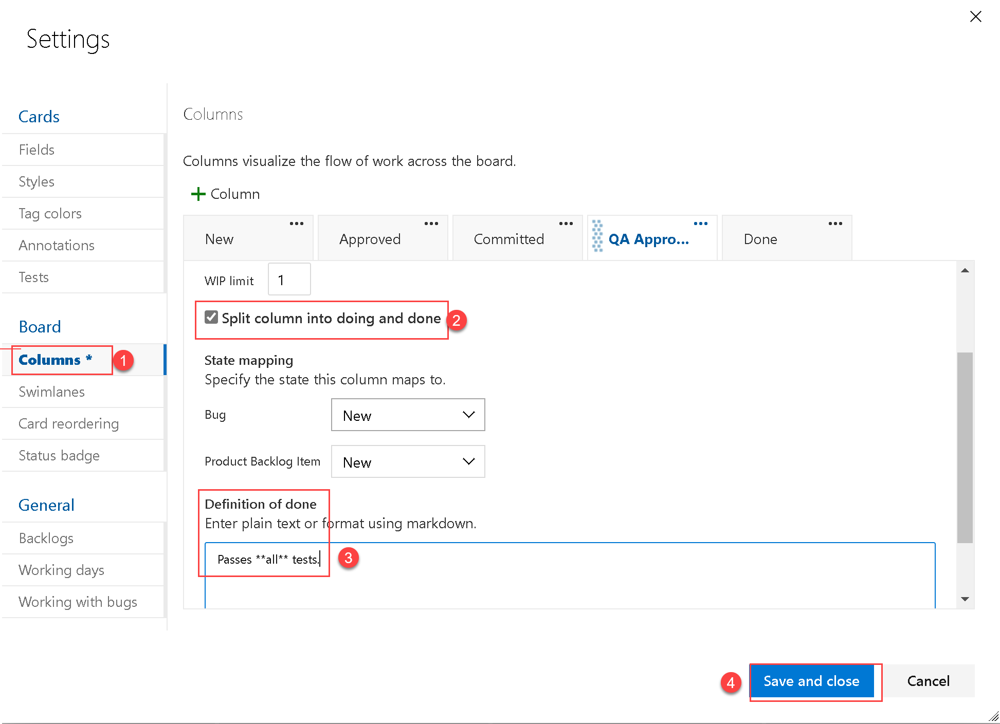

---
lab:
  title: Planeamiento ágil y administración de carteras con Azure Boards
  module: 'Module 01: Get started on a DevOps transformation journey'
---

# Planeamiento ágil y administración de carteras con Azure Boards

# Manual de laboratorio para alumnos

## Requisitos del laboratorio

- Este laboratorio requiere **Microsoft Edge** o un [explorador compatible con Azure DevOps](https://docs.microsoft.com/azure/devops/server/compatibility?view=azure-devops#web-portal-supported-browsers).

- **Configurar una organización de Azure DevOp:**: si aún no tiene una organización Azure DevOps que pueda usar para este laboratorio, cree una siguiendo las instrucciones disponibles en [Creación de una organización o colección de proyectos](https://docs.microsoft.com/azure/devops/organizations/accounts/create-organization?view=azure-devops).

## Introducción al laboratorio

En este laboratorio, conocerá las herramientas y procesos de planeación de Agile y administración de carteras que proporciona Azure Boards y cómo pueden ayudarle a planear y administrar el trabajo en todo su equipo, así como hacerle un seguimiento. Explorará el trabajo pendiente del producto, el trabajo pendiente de sprint y los paneles de tareas que pueden realizar un seguimiento del flujo de trabajo durante una iteración. También veremos las herramientas mejoradas en esta versión para escalar para equipos y organizaciones más grandes.

## Objetivos

Después de completar este laboratorio, podrá:

- Administrar equipos, áreas e iteraciones.
- Administrar elementos de trabajo.
- Administrar sprints y capacidad.
- Personalizar paneles Kanban.
- Definir paneles.
- Personalizar el proceso de equipo.

## Tiempo estimado: 60 minutos

## Instrucciones

### Ejercicio 0: configuración de los requisitos previos del laboratorio

> **Nota**: si ya creaste este proyecto durante los laboratorios anteriores, este ejercicio se puede omitir.

En este ejercicio, configurarás los requisitos previos para el laboratorio, lo que supone crear un nuevo proyecto de Azure DevOps con un repositorio basado en [eShopOnWeb](https://github.com/MicrosoftLearning/eShopOnWeb).

#### Tarea 1: (omitir si ya la has completado) crear y configurar el proyecto del equipo

En esta tarea, crearás un proyecto de **eShopOnWeb** de Azure DevOps que se usará en varios laboratorios.

1. En el equipo del laboratorio, en una ventana del explorador, abre la organización de Azure DevOps. Haz clic en **Nuevo proyecto**. Asígnale el nombre **eShopOnWeb** a tu proyecto. Establece la visibilidad como **Privado**.
1. Haz clic en **Avanzado** y especifica **Scrum** como el **Proceso de elemento de trabajo**.
 Haga clic en **Crear**.

    

### Ejercicio 1: administración de un proyecto con la metodología ágil

En este ejercicio, usarás Azure Boards para hacer varias tareas comunes de planeamiento ágil y administración de carteras, como la administración de equipos, áreas, iteraciones, elementos de trabajo, sprints y capacidad, personalización de paneles Kanban, definición de paneles y personalización de procesos de equipos.

#### Tarea 1: administrar equipos, áreas e iteraciones

En esta tarea, crearás un nuevo equipo y configurarás su área e iteraciones.

Cada proyecto nuevo se configura con un equipo predeterminado, que coincide con el nombre del proyecto. Puedes crear más equipos. A cada equipo se le puede conceder acceso a un conjunto de herramientas y recursos de equipo del método ágil. La capacidad de crear varios equipos ofrece la flexibilidad de elegir el equilibrio adecuado entre autonomía y colaboración en toda la empresa.

1. Compruebe que el explorador web muestre la organización de Azure DevOps con el proyecto **eShopOnWeb** que generó en el ejercicio anterior.

    > **Nota**: Como alternativa, para acceder directamente a la página del proyecto, vaya a la dirección URL [<https://dev.azure.com/>`<your-Azure-DevOps-account-name>`/eShopOnWeb), donde el marcador de posición `<your-Azure-DevOps-account-name>` representa el nombre de la cuenta.

1. Haz clic en el icono de engranaje con la etiqueta **Configuración del proyecto** situada en la esquina inferior izquierda de la página para abrir la página **Configuración del proyecto**.

    

1. En la sección **General**, seleccione la pestaña **Teams**. Ya hay un equipo predeterminado en este proyecto, **eShopOnWeb Team**, pero creará uno nuevo para este laboratorio. Haz clic en **Nuevo equipo**.

    

1. En el panel **Crear un nuevo equipo**, en el cuadro de texto **Nombre del equipo**, escribe **EShop-Web**, deja otras opciones con sus valores predeterminados y haz clic en **Crear**.

    

1. En la lista de **Equipos**, selecciona el equipo recién creado para ver sus detalles.

    > **Nota**: de forma predeterminada, serás miembro del nuevo equipo. Puedes usar esta vista para administrar funciones como la pertenencia al equipo, las notificaciones y los paneles.

1. Haz clic en el vínculo **Iteraciones y rutas de área** en la parte superior de la página **EShop-Web** para empezar a definir la programación y el ámbito del equipo.

    

1. En la parte superior del panel **Paneles**, selecciona la pestaña **Iteraciones** y haz clic en **+ Seleccionar iteraciones.**

    

1. Seleccione **eShopOnWeb\Sprint 1** y haga clic en **Guardar y cerrar**. Ten en cuenta que este primer sprint aparecerá en la lista de iteraciones, pero las fechas aún no están establecidas.
1. Selecciona **Sprint 1** y haz clic en los **puntos suspensivos (...)**. En el menú contextual, selecciona **Editar**.

     

    > **Nota**: especifica la fecha de inicio como el primer día laborable de la semana pasada y cuenta 3 semanas de trabajo completas para cada sprint. Por ejemplo, si el 6 de marzo es el primer día laborable del sprint, el periodo dura hasta el 24 de marzo. El sprint 2 comienza el 27 de marzo, que es tres semanas después del 6 de marzo.

1. Repite el paso anterior para agregar el **Sprint 2** y el **Sprint 3**. Podrías decir que estamos en la segunda semana del primer sprint.

    

1. Todavía en el panel **Configuración del proyecto / Boards / Configuración del equipo**, en la parte superior del panel, seleccione la pestaña **Áreas**. Encontrará un área generada automáticamente con el nombre que coincida con el nombre del equipo.

1. Haz clic en los puntos suspensivos (...) junto a la entrada **área predeterminada** y, en la lista desplegable, selecciona **Incluir subáreas**.

    

    > **Nota**: la configuración predeterminada para todos los equipos excluye las rutas de subárea. Lo cambiaremos para incluir subáreas para que el equipo pueda ver todos los elementos de trabajo de todos los equipos. O bien, el equipo de administración también puede optar por no incluir subáreas, lo que oculta automáticamente los elementos de trabajo en cuanto se les asigna a uno de los equipos.

#### Tarea 2: administrar elementos de trabajo

En esta tarea, aprenderás las tareas comunes de administración de elementos de trabajo.

Los elementos de trabajo cumplen un rol destacado en Azure DevOps. Ya sea que se describe el trabajo que se realizará, los impedimentos para publicar una versión, las definiciones de prueba u otros elementos clave, los elementos de trabajo son el caballo de batalla de los proyectos actuales. En esta tarea, te centrarás en el uso de varios elementos de trabajo para configurar el plan para ampliar el sitio de Parts Unlimited con una sección de aprendizaje del producto. Aunque puede ser abrumador crear una parte tan importante del contenido de una empresa, será muy fácil de administrar con Azure DevOps y con el proceso Scrum.

> **Nota**: esta tarea está diseñada para enseñar varias formas de crear diferentes tipos de elementos de trabajo, así como para demostrar la amplitud de las características disponibles en la plataforma. En consecuencia, estos pasos no deben considerarse instrucciones prescriptivas para la administración de proyectos. Las características son lo suficientemente flexibles como para adaptarse a las necesidades de tus procesos, así que explora y experimenta a medida que vas avanzando.

1. En el panel de navegación vertical del portal de Azure DevOps, selecciona el icono **Paneles** y, luego, **Elementos de trabajo**.

    > **Nota**: hay muchas maneras de crear elementos de trabajo en Azure DevOps, y descubriremos algunas de ellas. A veces es tan sencillo como activar una fuera de un panel.

1. En la ventana **Elementos de trabajo**, haz clic en **+ Nuevo elemento de trabajo > Epopeya**.

    

1. En el cuadro de texto **Escribir título**, escribe **Entrenamiento sobre el producto**.
1. En la esquina superior izquierda, selecciona la entrada **Sin asignar** y, en la lista desplegable, selecciona tu cuenta de usuario para asignar el nuevo elemento de trabajo. Si su nombre no aparece, comience a escribirlo y haga clic en **Buscar**.
1. Junto a la entrada **Área**, selecciona la entrada **eShopOnWeb** y, en la lista desplegable, selecciona **EShop-WEB**. Esto establecerá el **Área** como **eShopOnWeb\EShop-WEB**.
1. Junto a la entrada **Iteración**, selecciona la entrada **eShopOnWeb** y, en la lista desplegable, selecciona **Sprint 2**. Esto establecerá la **iteración** como **eShopOnWeb\Sprint 2**.
1. Para terminar de hacer cambios, haz clic en **Guardar**. **No cierres**.

    

    > **Nota**: normalmente, uno completa con la mayor cantidad de información posible, pero esto es suficiente para este laboratorio.

    > **Nota**: el formulario de elementos de trabajo tiene todos los ajustes de elementos de trabajo pertinentes. Esto incluye detalles sobre a quién está asignado, su estado en distintos parámetros y toda la información asociada, así como el historial que describe cómo se ha controlado desde la creación. Una de las áreas claves en las que debes centrarte es el **trabajo relacionado**. Descubriremos una de las formas de agregar una característica a esta epopeya.

1. En la sección **Trabajo relacionado** en la parte inferior derecha, selecciona la entrada **Agregar vínculo** y, en la lista desplegable, selecciona **Nuevo elemento**.
1. En el panel **Agregar vínculo**, en la lista desplegable **Tipo de vínculo**, selecciona **Secundario**. A continuación, en la lista desplegable **Tipo de elemento de trabajo**, selecciona **Característica**; en el cuadro de texto **Título** , escribe **Panel de entrenamiento** y haz clic en **Aceptar**.

    

    > **Nota**: en el **panel de entrenamiento**, ten en cuenta que la asignación, el **área** y la **iteración** ya están establecidos en los mismos valores de la epopeya en la que se basa la característica. Asimismo, la característica se vincula automáticamente con el elemento primario desde el cual se creó.

1. Haga clic en **Agregar vínculo** para guardar el elemento secundario. En el **Panel de formación** (Nueva característica), haga clic en **Guardar y cerrar**.

1. En el panel de navegación vertical del portal de Azure DevOps, en la lista de elementos **Paneles**, selecciona **Paneles**.
1. En el panel **Paneles**, selecciona la entrada **paneles de EShop-WEB**. Se abrirá el panel para ese equipo determinado.

    

1. En el panel **Paneles**, en la esquina superior derecha, selecciona la entrada **Elementos de trabajos pendientes** y, en la lista desplegable, selecciona **Características**.

    > **Nota**: esto facilita la adición de tareas y otros elementos de trabajo a las características.

1. Mantén el puntero del mouse sobre el rectángulo que representa la característica **Panel de entrenamiento**. Aparecerán los puntos suspensivos (...) en la esquina superior derecha.
1. Haz clic en el icono de puntos suspensivos (...) y, en la lista desplegable, selecciona **Agregar elemento de trabajo pendiente**.

    

1. En el cuadro de texto del nuevo elemento de trabajo pendiente, escribe **Como cliente, me gustaría ver nuevos tutoriales** y presiona la tecla **Entrar** para guardar la entrada.

    > **Nota**: se crea un nuevo elemento de trabajo de pendiente del producto (PBI, por sus siglas en inglés), que es un elemento secundario de la característica y comparte su área e iteración.

1. Repite el paso anterior para agregar dos PBI más, diseñados para que el cliente vea los últimos tutoriales vistos y solicite nuevos tutoriales denominados, respectivamente, **Como cliente, me gustaría ver los últimos tutoriales que he visto** y **Como cliente, me gustaría solicitar nuevos tutoriales**.

    

1. En el panel **Paneles**, en la esquina superior derecha, selecciona la entrada **Características** y, en la lista desplegable, selecciona **Elementos de trabajo pendiente**.

     

    > **Nota**: los elementos de trabajo pendiente tienen un estado que define en qué etapa del proceso se encuentran. Aunque puedes abrir y editar el elemento de trabajo con el formulario, es más fácil arrastrar las tarjetas hacia el panel.

1. En la pestaña **Panel** del panel **EShop-WEB**, arrastra el primer elemento de trabajo denominado **Como cliente, me gustaría ver nuevos tutoriales** de las fases **Nuevo** a **Aprobado**.

    

    > **Nota**: también puedes expandir tarjetas de elementos de trabajo para obtener detalles editables de manera práctica.

1. Mantén el puntero del mouse sobre el rectángulo que representa el elemento de trabajo que has movido a la fase **Aprobado**. Aparecerá el símbolo de intercalación hacia abajo.
1. Haz clic en el símbolo de intercalación hacia abajo para expandir la tarjeta del elemento de trabajo, selecciona la entrada **Sin asignar** y, en la lista de cuentas de usuario, selecciona tu cuenta para asignarte el PBI a ti mismo.
1. En la pestaña **Panel** del panel **EShop-WEB**, arrastra el segundo elemento de trabajo denominado **Como cliente, me gustaría ver los últimos tutoriales que he visto** desde la fase **Nuevo** hasta **Confirmado**.
1. En la pestaña **Panel** del panel **EShop-WEB**, arrastra el tercer elemento de trabajo denominado **Como cliente, me gustaría solicitar nuevos tutoriales** de la fase **Nuevo** hasta **Listo**.

    

    > **Nota**: el panel de tareas es una vista en los trabajos pendientes. También puedes usar la vista tabular.

1. En la pestaña **Panel** del panel **EShop-WEB**, en la parte superior del panel, haz clic en **Ver como trabajo pendiente** para mostrar el formulario tabular.

    

    > **Nota**: puedes usar el signo más situado justo debajo de la etiqueta de pestaña **Trabajo pendiente** del panel **EShop-WEB** para ver las tareas anidadas en estos elementos de trabajo.

    > **Nota**: puedes usar el segundo signo más situado justo a la izquierda del primer elemento de trabajo pendiente para agregarle una nueva tarea.

1. En la pestaña **Trabajo pendiente** del panel **EShop-WEB**, en la esquina superior izquierda del panel, haz clic en el segundo signo más de la parte superior, situado junto al primer elemento de trabajo. Aparecerá el panel **NUEVA TAREA**.

    

1. En la parte superior del panel **NUEVA TAREA**, en el cuadro de texto **Escribir título**, escribe **Agregar página para los tutoriales más recientes**.
1. En el panel **NUEVA TAREA**, en el cuadro de texto **Trabajo restante**, escribe **5**.
1. En el panel **NUEVA TAREA**, en la lista desplegable **Actividad**, selecciona **Desarrollo**.
1. En el panel **NUEVA TAREA**, haz clic en **Guardar y cerrar**.

    

1. Repite los cinco últimos pasos para agregar otra tarea denominada **Optimizar consulta de datos para los tutoriales más recientes **. Configura tu **Trabajo restante** con el valor **3** y elige la **Actividad**: **Diseño**. Haz clic en **Guardar y cerrar** cuando termines.

#### Tarea 3: administrar sprints y capacidad

En esta tarea, aprenderás las tareas más frecuentes de un sprint y de administración de capacidad.

El equipo crea el trabajo pendiente de sprint durante la reunión de planificación de sprints, que suele realizarse el primer día del sprint. Cada sprint corresponde a un intervalo de tiempo que admite la capacidad del equipo para trabajar con herramientas y procesos de la metodología ágil. Durante la reunión de planificación, el propietario del producto trabaja con su equipo para identificar esos casos o elementos de trabajo pendiente que se van a completar en el sprint.

Las reuniones de planificación normalmente constan de dos partes. En la primera parte, el equipo y el propietario del producto identifican los elementos de trabajo pendiente que el equipo siente que puede comprometerse a completar en el sprint, en función de la experiencia con sprints anteriores. Estos elementos se agregan al trabajo pendiente de sprint. En la segunda parte, el equipo determina cómo desarrollará y verificará cada elemento. Después, definen y calculan las tareas necesarias para completar cada elemento. Por último, el equipo se compromete a implementar algunos o todos los elementos en función de estos cálculos.

El trabajo pendiente de sprint debe contener toda la información que el equipo necesita para completar correctamente el trabajo dentro del tiempo asignado sin tener que apresurarse a último momento. Antes de planear el sprint, te recomendamos haber creado, priorizado y calculado el trabajo pendiente, y haber definido los sprints.

1. En el panel de navegación vertical del portal de Azure DevOps, selecciona el icono **Paneles** y, en la lista de elementos **Paneles**, selecciona **Sprints**.
1. En la pestaña **Panel de tareas** de la vista **Sprints**, en la barra de herramientas a la derecha, selecciona el símbolo ** Ver opciones** (directamente a la izquierda del icono de embudo) y, en la lista desplegable **Ver opciones**, selecciona la entrada **Detalles del trabajo**. Seleccione **Sprint 2** como filtro.

    

    > **Nota**: el sprint actual tiene un ámbito bastante limitado. Hay dos tareas en la fase **Tareas pendientes**. En este momento, no se ha asignado ninguna tarea. Ambas muestran un valor numérico a la derecha de la entrada **Sin asignar** que representa el cálculo del trabajo restante.

1. En la columna **ToDo**, fíjese en el elemento de tarea **Agregar página de tutoriales más recientes**, haga clic en la entrada **Sin asignar** y, en la lista de cuentas de usuario, seleccione su cuenta para asignarse la tarea.

1. Selecciona la pestaña **Capacidad** de la vista **Sprints**.

    > **Note**: This view enables you to define what activities a user can take on and at what level of capacity.

1. En la pestaña **Capacidad** de la vista **Sprints**, haga clic en **+Agregar usuario** y seleccione su cuenta de usuario. Para este usuario, establezca el campo **Actividad** en **Desarrollo** y, en el cuadro de texto **Capacidad por día**, escriba **1**.

    > **Nota**: esto representa 1 hora de trabajo de desarrollo al día. Ten en cuenta que puedes agregar actividades adicionales por usuario en caso de que hagan otras tareas además de desarrollo.

    > **Note**: Let's assume you're also going to take some vacation. Which should be added to the capacity view too.

1. En la pestaña ** Capacidad** de la vista **Sprints**, situada junto a la entrada que representa la cuenta de usuario, en la columna **Días libres**, haz clic en la entrada **0 días**. Aparecerá un panel en el que podrás establecer tus días libres.
1. En el panel que se visualiza, usa la vista de calendario para establecer tus vacaciones de modo que abarquen cinco días laborables durante el sprint actual (dentro de las próximas tres semanas) y, cuando termines, haz clic en **Aceptar**.

    

1. Cuando vuelvas a la pestaña **Capacidad** de la vista **Sprints**, haz clic en **Guardar**.
1. Selecciona la pestaña **Panel de tareas** de la vista **Sprints**.

    

    > **Nota:** ten en cuenta que el panel **Detalles del trabajo** se ha actualizado para reflejar el ancho de banda disponible. El número real que se muestra en el panel **Detalles del trabajo** puede variar, pero la capacidad total del sprint será igual que la cantidad de días laborables restantes hasta el final del sprint, ya que asignó 1 hora al día. Toma nota de este valor, ya que lo usarás en los próximos pasos.

    > **Nota**: una característica práctica de los paneles es que puedes actualizar fácilmente los datos clave en línea. Se recomienda actualizar periódicamente el cálculo de **Trabajo restante** para reflejar el tiempo previsto para cada tarea. Supongamos que has revisado el trabajo de la tarea **Agregar página para los tutoriales más recientes** y has descubierto que tardará más de lo esperado.

1. En la pestaña **Panel de tareas** de la vista **Sprints**, en el cuadro que representa **Agregar página para los tutoriales más recientes**, establece la cantidad prevista de horas en **14**, para que coincida con la capacidad total de este sprint, que has identificado en el paso anterior.

    

    > **Nota**: esto amplía automáticamente el **Desarrollo** y tus capacidades personales al máximo. Puesto que son lo suficientemente grandes como para cubrir las tareas asignadas, permanecen en verde. Sin embargo, la capacidad global del **Equipo** se supera debido a las 3 horas adicionales que requiere la tarea **Optimizar datos de consulta para los últimos tutoriales vistos**.

    > **Nota**: una manera de resolver este problema de capacidad sería mover la tarea a una iteración futura. Puedes hacerlo de distintas maneras. Por ejemplo, podrías abrir la tarea aquí y editarla en el panel que proporciona acceso a los detalles de la tarea. Otro enfoque sería usar la vista **Trabajo pendiente**, que proporciona una opción de menú en línea para moverla. De todos modos, aún no muevas la tarea.

1. En la pestaña **Panel de tareas** de la vista **Sprints**, en la barra de herramientas, a la derecha, seleccione el símbolo **Ver opciones** (directamente a la izquierda del icono de embudo) y, en la lista desplegable **Ver opciones**, seleccione la entrada **Asignado a=**.

    > **Nota**: esto ajusta la vista para que puedas revisar el progreso de las tareas por persona, en lugar de por elemento de trabajo pendiente.

    > **Nota**: también hay varias tareas de personalización disponibles.

1. Haz clic en el icono de engranaje **Configurar ajustes del equipo** (situado a la derecha del icono de embudo).
1. En el panel **Configuración**, selecciona la pestaña **Estilos**, haz clic en **+ Regla de estilos**, en la etiqueta ** Nombre**, en el cuadro de texto **Nombre**, escribe **Desarrollo** y, en la lista desplegable **Color de tarjeta**, selecciona el rectángulo verde.

    > **Nota**: todas las tarjetas aparecerán de color verde si cumplen los criterios de regla establecidos a continuación, en la sección **Criterios de regla**.

1. En la sección **Criterios de regla**, en la lista desplegable **Campo**, selecciona **Actividad**, en la lista desplegable **Operador**, selecciona **=** y, en la lista desplegable **Valor**, selecciona **Desarrollo.**

    

    > **Nota**: todas las tarjetas asignadas a actividades de **Desarrollo** aparecerán de color verde.

    

1. En el panel **Configuración**, selecciona la pestaña **Backlogs** (Trabajos pendientes).

    > **Nota**: las entradas de esta pestaña te permiten establecer los niveles disponibles para la navegación. Las epopeyas no se incluyen de forma predeterminada, pero puedes cambiar esto.

1. En el panel **Configuración**, selecciona la pestaña **Días laborables**.

    > **Nota**: las entradas de esta pestaña permiten especificar los **Días laborables** del equipo. Esto se aplica a los cálculos de capacidad y de evolución.

1. En el panel **Configuración**, selecciona la pestaña **Trabajar con errores**.

    > **Nota**: las entradas de esta pestaña permiten especificar cómo se presentan los errores en el panel.

1. En el panel **Configuración**, haz clic en **Guardar y cerrar** para guardar la regla de estilo.

    > **Nota**: la tarea asociada al **Desarrollo** ahora aparece en verde y es muy fácil de identificar.

#### Tarea 4: personalizar paneles Kanban

En esta tarea, aprenderás a personalizar paneles Kanban.

Para maximizar la capacidad de un equipo de ofrecer software de alta calidad de forma constante, Kanban destaca dos procedimientos principales. El primero consiste en visualizar el flujo de trabajo, y requiere asignar las fases de flujo de trabajo del equipo y configurar un panel Kanban que coincida. El segundo consiste en restringir la cantidad de trabajo en curso. Esto requiere establecer los límites de trabajo en curso (WIP, por su sigla en inglés). Después, estará listo para realizar un seguimiento del progreso en el panel Kanban y supervisar las métricas clave para reducir el plazo o el tiempo de ciclo. El panel Kanban convierte el trabajo pendiente en un panel interactivo, de modo que se proporciona un flujo de trabajo visual. A medida que avanza el trabajo desde su concepción hasta la finalización, puede actualizar los elementos en el panel. Cada columna representa una fase de trabajo y cada tarjeta representa un caso de usuario (tarjetas azules) o un error (tarjetas rojas) en esa fase de trabajo. Sin embargo, cada equipo desarrolla su propio proceso a lo largo del tiempo, por lo que la capacidad de personalizar el panel Kanban para que coincida con la forma en que el equipo funciona es fundamental para la entrega correcta.

1. En el panel de navegación vertical del portal de Azure DevOps, en la lista de elementos **Paneles**, selecciona **Paneles**.
1. En el panel **Boards**, haga clic en el icono de engranaje **Configurar ajustes del panel** (directamente a la derecha del icono de embudo).

    > **Nota**: el equipo hace hincapié en el trabajo realizado con los datos, por lo que se presta especial atención a cualquier tarea asociada al acceso o el almacenamiento de datos.

1. En el panel **Configuración**, selecciona la pestaña **Colores de etiqueta** y haz clic en **+ Color de etiqueta**. En el cuadro de texto ** Etiqueta**, escribe **datos** y deja el color predeterminado.

    

    > **Nota**: cada vez que se etiqueta un elemento de trabajo pendiente o un error con **datos**, esa etiqueta se resaltará.

1. En **Configurar ajustes del panel** (engranaje) en el panel **Configuración**, seleccione la pestaña **Anotaciones**.

    > **Nota**: puedes especificar qué **Anotaciones** quieres incluir en las tarjetas para que sean más fáciles de leer y navegar. Cuando se habilita una anotación, es fácil acceder a los elementos de trabajo secundarios de ese tipo haciendo clic en la visualización en cada tarjeta.

1. En el panel **Configuración**, selecciona la pestaña **Pruebas**.

    > **Nota**: la pestaña **Pruebas** te permite configurar cómo se ven y se comportan las pruebas en las tarjetas.

1. En el panel **Configuración**, haz clic en **Guardar y cerrar** para guardar la regla de estilo.
1. Desde la pestaña **Panel** del panel **EShop-WEB**, abra el elemento de trabajo que representa el elemento de trabajo pendiente **Como cliente, quiero ver nuevos tutoriales**.
1. En la vista detallada de elementos, en la parte superior del panel, a la derecha de la entrada **0 comentarios**, haga clic en **Añadir etiqueta**.
1. En el cuadro de texto que aparece, escribe **datos** y presiona la tecla **Entrar**.
1. Repite el paso anterior para agregar la etiqueta **ux**.
1. Guarde estas modificaciones haciendo clic en **Guardar y cerrar**.

    

    > **Nota**: ahora las dos etiquetas están visibles en la tarjeta, con la etiqueta **datos** resaltada en amarillo.

1. En el panel **Boards**, haga clic en el icono de engranaje **Configurar ajustes del panel** (directamente a la derecha del icono de embudo).
1. En el panel **Configuración**, selecciona la pestaña **Columnas**.

    > **Nota**: esta sección permite agregar nuevas fases al flujo de trabajo.

1. Haz clic en **+ Columna**; en la etiqueta **Nombre de columna**, en el cuadro de texto **Nombre**, escribe **Control de calidad aprobado** y, en el cuadro de texto **Límite de WIP**, escribe **1**.

    > **Nota**: el límite de trabajo en curso de 1 indica que solo puede haber un elemento de trabajo a la vez en esta fase. Normalmente, establecerías un valor más alto, pero solo hay dos elementos de trabajo para demostrar la característica.

    

1. En el panel **Configuración**, seleccione de nuevo la pestaña **Columnas**. Fíjese en los puntos suspensivos junto a la columna **QA aprobado** que ha creado. Seleccione **Mover a la derecha** dos veces, para que la columna QA aprobado se sitúe entre **Confirmado** y **Hecho**.
1. En el panel **Configuración**, haga clic en **Guardar**.

1. **Actualice** el **portal de Boards**, para que la columna **QA aprobado** sea visible ahora en la vista del panel de Kanban.
1. Arrastra el elemento de trabajo **Como cliente, me gustaría ver los últimos tutoriales que he visto** desde la fase **Confirmado** hasta **Control de calidad aprobado**.
1. Arrastra el elemento de trabajo **Como cliente, me gustaría ver nuevos tutoriales** desde la fase **Aprobado** hasta **Control de calidad aprobado**.

    

    > **Nota**: la fase ahora supera su límite **WIP** y aparece en rojo como advertencia.

1. Mueve el elemento de trabajo pendiente **Como cliente, me gustaría ver los últimos tutoriales que he visto** al estado **Confirmado**.
1. En el panel **Boards**, haga clic en el icono de engranaje **Configurar ajustes del panel** (directamente a la derecha del icono de embudo).
1. En el panel **Configuración**, vuelve a la pestaña **Columnas** y selecciona la pestaña **Control de calidad aprobado**.

    > **Nota**: suele haber una demora entre el momento en que el trabajo se mueve a una columna y el inicio real del trabajo. Para contrarrestar ese retraso y revelar el estado real del trabajo en curso, puede activar las columnas divididas. Cuando se dividen, cada columna tiene dos subcolumnas, **En curso** y **Listo**. Las columnas divididas permiten al equipo implementar un modelo de extracción. Sin la división de columnas, los equipos insertan el trabajo para indicar que han completado su fase de trabajo. Sin embargo, enviarlo a la siguiente fase no significa necesariamente que un miembro del equipo inicie inmediatamente el trabajo en ese elemento.

1. En la pestaña **Control de calidad aprobado**, habilita la casilla **Dividir la columna en En curso y Listo** para crear dos columnas independientes.

    > **Nota**: a medida que el equipo actualiza el estado del trabajo mientras avanza de una fase a la siguiente, esto ayuda a que lleguen a un acuerdo respecto a lo que significa **Listo**. Al especificar la **Definición de Listo** para cada columna Kanban, ayudas a compartir las tareas esenciales que se deben completar antes de mover un elemento a una fase de nivel inferior.

1. En la pestaña **Control de calidad aprobado**, en la parte inferior del panel, en el cuadro de texto **Definición de Listo**, escribe **Passa \*\*todas\*\* las pruebas**.
1. En el panel **Configuración**, haz clic en **Guardar y cerrar**.

    

    > **Nota**: la fase **Control de calidad aprobado** ahora tiene las columnas **En curso** y **Listo** . También puedes hacer clic en el símbolo informativo (con la letra **i** en un círculo) junto al encabezado de columna para leer la **Definición de Listo**.

1. En el panel **Boards**, haga clic en el icono de engranaje **Configurar ajustes del panel** (directamente a la derecha del icono del embudo).

    > **Nota**: el panel Kanban admite la capacidad de visualizar el flujo de trabajo a medida que pasas de Nuevo a Listo. Cuando agregas **calles**, también puedes ver el estado del trabajo que admite diferentes clases de nivel de servicio. Puede crear un carril para representar cualquier otra dimensión que admita sus necesidades de seguimiento.

1. En el panel **Configuración**, selecciona la pestaña **Calles**.
1. En la pestaña **Calles**, haz clic en **+ Calle** debajo de la etiqueta **Nombre de la calle**, en el cuadro de texto **Nombre**, escribe **Acelerar**.
1. En el panel **Configuración**, haga clic en **Guardar**.

    

1. Cuando vuelvas a la pestaña **Panel** del tablero **Paneles**, arrastra y coloca el elemento de trabajo **Confirmado** en la fase **Control de calidad aprobado\|En curso** por la calle **Acelerar** para que se reconozca como prioritario cuando el ancho de banda de control de calidad esté disponible.

#### Tarea 5: personalizar el proceso del equipo

En esta tarea crearemos un proceso personalizado basado en Scrum. El proceso tendrá un campo de elemento de trabajo pendiente diseñado para realizar un seguimiento de un identificador de vale propio eShopOnWeb.

En Azure DevOps, personalizará la experiencia de seguimiento del trabajo a través de un proceso. Un proceso define los bloques de creación del sistema de seguimiento de elementos de trabajo y otros subsistemas a los que accedes a través de Azure DevOps. Siempre que creas un proyecto de equipo, selecciona el proceso que contiene los bloques de creación para el proyecto. Azure DevOps admite dos tipos de proceso. En el primero, los procesos principales del sistema (Scrum, Agile y CMMI) son de solo lectura, por lo que no se pueden personalizar. En el segundo, los procesos heredados se crean en función de los procesos principales del sistema, con la opción de personalizar su configuración.

Todos los procesos se comparten dentro de la misma organización. Es decir, uno o varios proyectos del equipo pueden hacer referencia a un solo proceso. En lugar de personalizar un solo proyecto del equipo, se personaliza un proceso. Los cambios realizados en el proceso actualizan automáticamente todos los proyectos del equipo que hacen referencia a ese proceso. Una vez creado un proceso heredado, puedes personalizarlo, crear proyectos de equipo basados en él y migrar proyectos de equipo existentes para hacer referencia a él. El proyecto del equipo de Git solo se puede personalizar una vez que migra a un proceso heredado.

1. En la página Azure DevOps, haz clic en el logotipo de **Azure DevOps** en la esquina superior izquierda para ir a la página raíz de la cuenta.
1. Haz clic en el botón **Configuración de la organización** en la esquina inferior izquierda de la página.
1. En el menú vertical **Configuración de la organización**, en la sección **Paneles**, selecciona **Proceso**.
1. En el panel **Todos los procesos**, a la derecha de la entrada **Scrum**, selecciona los puntos suspensivos (...) y, en el menú desplegable, selecciona **Crear proceso heredado**.

    

1. En el panel **Crear proceso heredado de Scrum**, en el cuadro de texto **Nombre del proceso (obligatorio)**, escribe **Scrum personalizado** y haz clic en **Crear proceso**.
1. Cuando vuelvas al panel **Todos los procesos**, haz clic en la entrada **Scrum personalizado**.

    > **Nota**: es posible que tengas que actualizar el explorador para ver el nuevo proceso.

1. En el panel **Todos los procesos > Scrum personalizado**, selecciona **Elemento de trabajo pendiente**.

    

1. En el panel **Todos los procesos > Scrum personalizado > Elemento de trabajo pendiente**, haz clic en **Campo nuevo**.
1. En el panel **Agregar un campo al elemento de trabajo pendiente**, en la pestaña **Definición**, en la sección **Crear un campo**, en el cuadro de texto **Nombre**, escribe **Identificador de vale de EShop**.

    

1. En el panel **Agregar un campo al elemento de trabajo pendiente**, haz clic en **Diseño**.
1. En el panel **Agregar un campo al elemento de trabajo pendiente de producto**, en la pestaña **Diseño**, en el cuadro de texto **Etiqueta**, escriba **Id. de vale**, seleccione la opción **Crear un nuevo grupo**, en el cuadro de texto **Grupo**, escriba **eShopOnWeb** y haga clic en **Agregar campo**.

    

    > **Nota**: ahora que se ha configurado el proceso personalizado, vamos a cambiar al proyecto eShopOnWeb para usarlo.

1. Vuelve a la raíz de **Todos los procesos** mediante la ruta de navegación en la sección superior de **Todos los procesos > Scrum personalizado > Elemento de trabajo pendiente**.
1. En el panel **Todos los procesos**, selecciona la entrada **Scrum**.

    

    > **Nota**: nuestro proyecto actual usa **Scrum**.

1. En el panel **Todos los procesos > Scrum**, selecciona la pestaña **Proyectos**.
1. En la lista de proyectos, en la fila que contiene la entrada **eShopOnWeb**, selecciona el símbolo de puntos suspensivos (...) y, a continuación, selecciona **Cambiar proceso**.
1. En el panel **Cambiar el proceso del proyecto**, en la lista desplegable **Seleccionar un proceso de destino**, selecciona el proceso **Personalización de Scrum**, haz clic en **Guardar** y después en **Cerrar**.

    

1. Haz clic en el logotipo de **Azure DevOps** en la esquina superior izquierda para volver a la página raíz de la cuenta.
1. En la pestaña **Proyectos**, selecciona la entrada que representa el proyecto **eShopOnWeb**.
1. En el menú vertical del lado izquierdo de la página **eShopOnWeb**, selecciona **Paneles** y asegúrate de que aparezca el panel **Elementos de trabajo**.
1. En la lista de elementos de trabajo, haz clic en el primer elemento de trabajo pendiente.
1. Comprueba si ahora tienes el campo **Identificador de vale** en el grupo **eShopOnWeb**, que se definió durante la personalización del proceso. Puedes tratar esto como cualquier otro campo de texto.

    

    > **Nota**: una vez guardado el elemento de trabajo, Azure DevOps también guardará la nueva información personalizada para que esté disponible para las consultas y el resto de Azure DevOps.

### Ejercicio 2 (opcional): definición de paneles

En esta tarea, aprenderás el proceso de creación de paneles y sus componentes principales.

Los paneles permiten a los equipos visualizar el estado y supervisar el progreso en todo el proyecto. Rápidamente puedes tomar decisiones informadas sin tener que explorar en profundidad otras partes del sitio del proyecto del equipo. La página Información general proporciona acceso a un panel de equipo predeterminado que puedes personalizar agregando, quitando o reorganizando los iconos. Cada icono corresponde a un widget que proporciona acceso a una o varias características o funciones.

1. En el panel de navegación vertical del portal de Azure DevOps, selecciona el icono **Información general** y, en la lista de elementos **Información general**, selecciona **Paneles**.
1. Si es necesario, en el panel **Paneles**, en la esquina superior izquierda, en la sección **Equipo de eShopOnWeb**, selecciona **Equipo de eShopOnWeb - Información general** y revisa el panel existente.

    

1. En **Paneles**, selecciona el menú desplegable situado junto al título **Equipo de eShopOnWeb - Información general** y selecciona **+ Nuevo panel**.

    

1. En el panel **Crear un panel**, en el cuadro de texto **Nombre**, escribe **Entrenamiento del producto**, en la lista desplegable **Equipo**, selecciona el equipo **EShop-WEB** y haz clic en **Crear**.

    

1. En el panel de nuevo panel, haz clic en **Agregar un widget**.
1. En el panel **Agregar widget**, en el cuadro de texto **Buscar**, escribe **sprint** para buscar widgets existentes que se centran en los sprints. En la lista de resultados, selecciona **Información general de sprint** y haz clic en **Agregar**.
1. En el rectángulo que representa el widget recién agregado, haz clic en el icono de engranaje **Configuración** y revisa el panel **Configuración**.

    > **Nota**: el nivel de personalización variará según el widget.

1. En el panel **Configuración**, haz clic en **Cerrar** sin realizar ningún cambio.
1. Cuando vuelvas al panel **Agregar widget**, en el cuadro de texto **Buscar**, escribe **sprint** nuevamente para buscar widgets existentes que se centren en sprints. En la lista de resultados, selecciona **Capacidad de sprint** y haz clic en **Agregar**.
1. En la vista **Panel**, en la parte superior del panel, haz clic en **Edición finalizada**.

    

    > **Nota**: ahora puedes revisar dos aspectos importantes del sprint actual en el panel personalizado.

    > **Nota**: otra manera de personalizar paneles es generando gráficos basados en consultas de elementos de trabajo, que puedes compartir en un panel.

1. En el panel de navegación vertical del portal de Azure DevOps, selecciona el icono **Paneles** y, en la lista de elementos **Paneles**, selecciona **Consultas**.
1. En el panel **Consultas**, haz clic en **+ Nueva consulta**.
1. En la pestaña **Editor** del panel **Consultas > Mis consultas**, en la lista desplegable **Valor** de la fila **Tipo de elemento de trabajo**, selecciona **Tarea**.
1. En la pestaña **Editor** del panel **Consultas > Mis consultas**, en la segunda fila, en la columna **Campo**, selecciona **Ruta de acceso del área** y, en la lista desplegable ** Valor** correspondiente, selecciona **eShopOnWeb\\EShop-WEB**.
1. Haz clic en **Guardar consulta**.

    

1. En el panel **Nueva consulta**, en el cuadro de texto **Escribir nombre**, escribe **Tareas web**, en la lista desplegable **Carpeta**, selecciona **Consultas compartidas** y haz clic en **Aceptar**.
1. En la vista **Consultas>Consultas compartidas**, seleccione la pestaña **Gráficos** y haga clic en **+ Nuevo gráfico**.
1. En el panel **Configurar gráfico**, en el cuadro de texto **Nombre**, escriba **Tareas web - Por asignación**, en la lista desplegable **Agrupar por**, seleccione **Asignado a** y haga clic en **Guardar gráfico** para guardar los cambios.

    

    > **Nota**: ahora puedes agregar este gráfico a un panel.

1. Vuelva a la sección **Paneles** en el menú de **Información general**. En la sección **Eshop-Web**, seleccione el panel **Formación sobre productos** que usó anteriormente, para abrirlo.

1. Haz clic en **Editar** en el menú superior. En la lista **Agregar widget**, busque **Gráfico** y seleccione **Gráfico para elementos de trabajo**. Haga clic en **Agregar** para agregar este widget al panel de EShop-Web.

1. Haga clic en el **configurar** (engranaje) dentro del **Gráfico para elementos de trabajo** para abrir la configuración del widget.

1. Acepte el título tal como está. En **Consulta**, seleccione **Consultas compartidas o tareas web**. Mantenga **Circular** para el tipo de gráfico. En **Agrupar por**, seleccione **Asignado a**. Mantenga los valores predeterminados de Agregación (recuento) y Ordenación (valor / ascendente).

1. Para confirmar la configuración, haga clic en **Guardar**.

1. Observe que el gráfico circular de resultados de la consulta se muestra en el panel. **Guarde** los cambios pulsando el botón **Edición finalizada** de la parte superior.

## Revisar

En este laboratorio has usado Azure Boards para realizar una serie de tareas comunes de planeamiento ágil y de administración de carteras, incluida la administración de equipos, áreas, iteraciones, elementos de trabajo, sprints y capacidad, personalización de paneles Kanban, definición de paneles y personalización de procesos del equipo.
