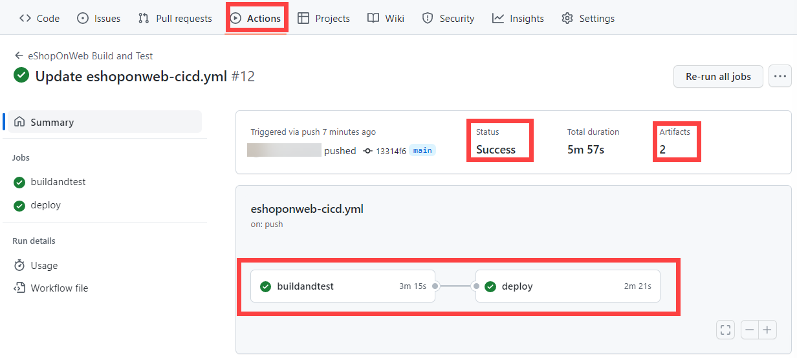

---
lab:
  title: Implementación de Acciones de GitHub para CI/CD
  module: 'Module 02: Implement CI with Azure Pipelines and GitHub Actions'
---

# Implementación de Acciones de GitHub para CI/CD

## Requisitos del laboratorio

- Este laboratorio requiere **Microsoft Edge** o un [explorador compatible con Azure DevOps](https://docs.microsoft.com/azure/devops/server/compatibility).

- Identifique una suscripción de Azure existente o cree una.

- Compruebe que tiene una cuenta de Microsoft o de Microsoft Entra con el rol Propietario o Colaborador en la suscripción a Azure. Para más información, consulte [Enumeración de asignaciones de roles de Azure mediante Azure Portal](https://docs.microsoft.com/azure/role-based-access-control/role-assignments-list-portal) y [Ver y asignar roles de administrador en Azure Active Directory](https://docs.microsoft.com/azure/active-directory/roles/manage-roles-portal).

- **Si aún no tienes una cuenta de GitHub** que puedas usar para este laboratorio, sigue las instrucciones disponibles en [Registro para obtener una nueva cuenta de GitHub](https://github.com/join) para crear una.

## Introducción al laboratorio

En este laboratorio, aprenderás a implementar un flujo de trabajo de Acciones de GitHub que implementa una aplicación web de Azure.

## Objetivos

Después de completar este laboratorio, podrá:

- Implemente un flujo de trabajo de Acciones de GitHub para CI/CD.
- Explicar las características básicas de los flujos de trabajo de Acciones de GitHub

## Tiempo estimado: 40 minutos

## Instrucciones

### Ejercicio 1: Importar eShopOnWeb al repositorio de GitHub

En este ejercicio, importarás el código del repositorio [eShopOnWeb](https://github.com/MicrosoftLearning/eShopOnWeb) existente en tu repositorio privado de GitHub.

El repositorio se organiza de la siguiente manera:
- La carpeta **.ado** contiene canalizaciones de YAML de Azure DevOps.
- El contenedor de carpetas **.devcontainer** está configurado para realizar el desarrollo con contenedores (ya sea localmente en VS Code o GitHub Codespaces).
- La carpeta **infra** contiene la infraestructura de Bicep y ARM como plantillas de código usadas en algunos escenarios de laboratorio.
- Definiciones de flujo de trabajo de GitHub del contenedor de carpetas **.github**.
- La carpeta **src** contiene el sitio web de .NET 8 que se usa en los escenarios de laboratorio.

#### Tarea 1: Crear un repositorio público en GitHub e importar eShopOnWeb

En esta tarea, crearás un repositorio de GitHub público vacío e importarás el repositorio [eShopOnWeb](https://github.com/MicrosoftLearning/eShopOnWeb) existente.

1. En el equipo del laboratorio, abre un explorador web, accede al [sitio web de GitHub](https://github.com/), inicia sesión con tu cuenta y haz clic en **Nuevo** para crear un repositorio nuevo.

    

1. En la página **Crear un nuevo repositorio**, haz clic en el vínculo **Importar un repositorio** (debajo del título de página).

    > **Nota**: También puedes abrir el sitio web de importación directamente en <https://github.com/new/import>

1. En la página **Importar el proyecto a GitHub**:

    | Campo | Value |
    | --- | --- |
    | Dirección URL del repositorio de origen| <https://github.com/MicrosoftLearning/eShopOnWeb> |
    | Propietario | Alias de tu cuenta |
    | Nombre del repositorio | eShopOnWeb |
    | Privacidad | **Pública** |

1. Haz clic en **Comenzar importación** y espera a que el repositorio esté listo.

1. En la página del repositorio, ve a **Configuración**, haz clic en **Acciones > General** y elige la opción **Permitir todas las acciones y los flujos de trabajo reutilizables**. Haga clic en **Guardar**.

    

### Ejercicio 2: Configurar el repositorio de GitHub y el acceso a Azure

En este ejercicio, crearás una entidad de servicio de Azure para autorizar a GitHub a acceder a la suscripción de Azure desde las Acciones de GitHub. También configurarás el flujo de trabajo de GitHub que compilará, probará e implementará el sitio web en Azure.

#### Tarea 1: crear una entidad de servicio de Azure y guardarla como secreto de GitHub

En esta tarea, crearás la entidad de servicio de Azure que usa GitHub para implementar los recursos deseados. Como alternativa, también podrías usar [OpenID connect en Azure](https://docs.github.com/actions/deployment/security-hardening-your-deployments/configuring-openid-connect-in-azure), como mecanismo de autenticación sin secretos.

1. En tu equipo del laboratorio, abre Azure Portal en una ventana del explorador (<https://portal.azure.com/>).
1. En el portal, busca **Grupos de recursos** y haz clic en esa opción.
1. Haz clic en **+ Crear** para crear un nuevo grupo de recursos para el ejercicio.
1. En la pestaña **Crear un grupo de recursos**, asigne el nombre siguiente al grupo de recursos: **rg-eshoponweb-NAME** (reemplace NAME por un alias único). Haz clic en **Revisar + crear > Crear**.
1. En el Portal de Azure, abre **Cloud Shell** (junto a la barra de búsqueda).

    > **Nota**: Si Azure Portal te pide que crees un almacenamiento, puedes elegir la opción **No se requiere ninguna cuenta de almacenamiento** y, después, selecciona tu suscripción y haz clic en el botón **Aplicar**.

1. Asegúrate de que el terminal se ejecuta en modo **Bash** y ejecuta el siguiente comando, reemplazando **SUBSCRIPTION-ID** y **RESOURCE-GROUP** con tus propios identificadores (ambos se pueden encontrar en la página **Información general** del grupo de recursos):

    `az ad sp create-for-rbac --name GH-Action-eshoponweb --role contributor --scopes /subscriptions/SUBSCRIPTION-ID/resourceGroups/RESOURCE-GROUP --sdk-auth`

    > **Nota**: Asegúrate de que se introduzca o pegue en una sola línea.

    > **Nota**: Este comando creará una entidad de servicio con acceso de colaborador al grupo de recursos creado antes. De este modo, nos aseguramos de que las Acciones de GitHub solo tendrán los permisos necesarios para interactuar solo con este grupo de recursos (no con el resto de la suscripción).

1. El comando generará un objeto JSON que más adelante usarás como secreto de GitHub para el flujo de trabajo. Copia el archivo JSON. El archivo JSON contiene los identificadores usados para autenticar en Azure en el nombre de una identidad Microsoft Entra (entidad de servicio).

    ```JSON
        {
            "clientId": "<GUID>",
            "clientSecret": "<GUID>",
            "subscriptionId": "<GUID>",
            "tenantId": "<GUID>",
            (...)
        }
    ```

1. (Omitir si ya está registrado) También debes ejecutar el siguiente comando para registrar el proveedor de recursos para el **Azure App Service** que implementarás más adelante:

   ```bash
   az provider register --namespace Microsoft.Web
   ```

1. En una ventana del explorador, vuelve al repositorio de GitHub **eShopOnWeb** .
1. En la página del repositorio, ve a **Configuración**, haz clic en **Secretos y variables > Acciones**. Haz clic en **Nuevo secreto de repositorio**.
    - Nombre: **`AZURE_CREDENTIALS`**
    - Secreto: **pega el objeto JSON copiado anteriormente** (GitHub puede mantener varios secretos con el mismo nombre, que usa la acción [azure/login](https://github.com/Azure/login))

1. Haz clic en **Agregar secreto**. Ahora Acciones de GitHub podrá hacer referencia a la entidad de servicio mediante el secreto del repositorio.

#### Tarea 2: modificar y ejecutar el flujo de trabajo de GitHub

En esta tarea, modificarás el flujo de trabajo de GitHub determinado y lo ejecutarás para implementar la solución en tu propia suscripción.

1. En una ventana del explorador, vuelve al repositorio de GitHub **eShopOnWeb** .
1. En la página del repositorio, ve a **Code** y abre el siguiente archivo: **eShopOnWeb/.github/workflows/eshoponweb-cicd.yml**. Este flujo de trabajo define el proceso de CI/CD para el código de sitio web de .NET 8 especificado.
1. Quita la marca de comentario de la sección **en** (elimina "#"). El flujo de trabajo se desencadena con cada inserción en la rama principal y también ofrece desencadenadores manuales ("workflow_dispatch").
1. En la sección **env**, haz los cambios siguientes:
    - Reemplaza **NAME** en la variable **RESOURCE-GROUP**. Debería ser el mismo grupo de recursos que creaste en una prueba anterior.
    - (Opcional) Puedes elegir la [región de Azure](https://azure.microsoft.com/explore/global-infrastructure/geographies) más cercana en **LOCATION**. Por ejemplo, "eastus", "eastasia", "westus", etc.
    - Reemplaza **YOUR-SUBS-ID** en **SUBSCRIPTION-ID**.
    - Reemplaza **NAME** en **WEBAPP-NAME** por un alias único. Se usará para crear un sitio web único globalmente mediante Azure App Service.
1. Lee detenidamente el flujo de trabajo y los comentarios que se proporcionan para entender mejor.

1. Haz clic en **Confirmar cambios...** en la parte superior derecha y en **Confirmar cambios** dejando los valores predeterminados (cambiando la rama principal). El flujo de trabajo se ejecutará automáticamente.

#### Tarea 3: revisar la ejecución del flujo de trabajo de GitHub

En esta tarea, revisarás la ejecución del flujo de trabajo de GitHub:

1. En una ventana del explorador, vuelve al repositorio de GitHub **eShopOnWeb** .
1. En la página del repositorio, ve a **Acciones** y verás la configuración del flujo de trabajo antes de ejecutarse. Haga clic en él.

    

1. Espera a que finalice la ejecución del flujo de trabajo. En **Resumen**, puedes ver las dos tareas del flujo de trabajo, el estado y los artefactos retenidos de la ejecución. Puedes hacer clic en cada trabajo para revisar los registros.

    

1. En una ventana del explorador, vuelva a Azure Portal (<https://portal.azure.com/>). Abre el grupo de recursos creado antes. Verás que la Acción de GitHub, mediante una plantilla de bicep, ha creado un plan de App Service de Azure y App Service. Puedes ver el sitio web publicado abriendo App Service y haciendo clic en **Examinar**.

    

#### (OPCIONAL) Tarea 4: agregar la aprobación manual previa a la implementación mediante entornos de GitHub

En esta tarea, usarás entornos de GitHub para solicitar la aprobación manual antes de ejecutar las acciones definidas en el trabajo de implementación del flujo de trabajo.

1. En la página del repositorio, ve a **Código** y abre el siguiente archivo: **eShopOnWeb/.github/workflows/eshoponweb-cicd.yml**.
1. En la sección **Implementar** trabajo, puede encontrar una referencia a un **entorno** denominado **Desarrollo**. Los [entornos](https://docs.github.com/en/actions/deployment/targeting-different-environments/using-environments-for-deployment) usados de GitHub agregan reglas de protección (y secretos) para los destinos.

1. En la página del repositorio, ve a **Configuración**, abre **Entornos** y haz clic en **Nuevo entorno**.
1. Asígnale el nombre **`Development`** y haz clic en **Configurar entorno**.

    > **Nota**: Si ya existe un entorno denominado **Desarrollo** en la lista **Entornos**, abre su configuración haciendo clic en el nombre del entorno.  

1. En la pestaña **Configurar desarrollo**, activa la opción **Revisores necesarios** y tu cuenta de GitHub como revisor. Haz clic en **Guardar reglas de protección**.
1. Ahora vamos a probar la regla de protección. En la página del repositorio, ve a **Actions**, haz clic en el flujo de trabajo **eShopOnWeb Build and Test** y haz clic en **Run workflow > Run workflow** para la ejecución manual.

    

1. Haz clic en la ejecución iniciada del flujo de trabajo y espera a que finalice el trabajo **compilación y prueba**. Verás una solicitud de revisión cuando llegues al trabajo **implementación**.

1. Haz clic en **Revisar implementaciones**, marca **Desarrollo** y haz clic en **Aprobar e implementar**.

    

1. El flujo de trabajo seguirá ejecutando el trabajo de **implementación** y finalizará.

> [!IMPORTANT]
> Recuerda eliminar los recursos creados en Azure Portal para evitar cargos innecesarios.

## Revisión

En este laboratorio, aprenderás a implementar un flujo de trabajo de Acción de GitHub que implementa una aplicación web de Azure.
