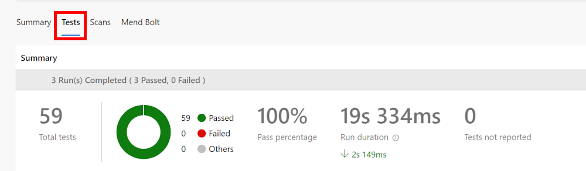

---
lab:
  title: Configuración y ejecución de pruebas funcionales
  module: 'Module 03: Design and implement a release strategy'
---

# Configuración y ejecución de pruebas funcionales

## Requisitos del laboratorio

- Este laboratorio requiere **Microsoft Edge** o un [explorador compatible con Azure DevOps](https://docs.microsoft.com/azure/devops/server/compatibility).

- **Configurar una organización de Azure DevOp:**: si aún no tiene una organización Azure DevOps que pueda usar para este laboratorio, cree una siguiendo las instrucciones disponibles en [Creación de una organización o colección de proyectos](https://learn.microsoft.com/dotnet/architecture/modern-web-apps-azure/test-asp-net-core-mvc-apps).

## Introducción al laboratorio

En el software de cualquier complejidad se pueden producir errores inesperados en respuesta a los cambios. Por tanto, es necesario realizar pruebas después de realizar cambios en todas las aplicaciones menos en las más triviales (o las menos críticas). Las pruebas manuales son la forma más lenta, menos confiable y más costosa de probar software.

Hay muchos tipos de pruebas automatizadas para las aplicaciones de software. La prueba más sencilla y de nivel más bajo es la prueba unitaria. En un nivel ligeramente superior se encuentran las pruebas de integración y las pruebas funcionales. Otros tipos de pruebas, como las de interfaz de usuario, de carga, de esfuerzo y de humo, quedan fuera del ámbito de este laboratorio.

*Si deseas obtener más información sobre los distintos tipos de pruebas, te recomendamos leer este artículo: [Probar las aplicaciones ASP.NET Core MVC](https://learn.microsoft.com/dotnet/architecture/modern-web-apps-azure/test-asp-net-core-mvc-apps).*

## Objetivos

Después de completar este laboratorio, podrás configurar una canalización de CI para una aplicación .Net que incluya:

- Pruebas unitarias
- Pruebas de integración
- Pruebas funcionales

## Tiempo estimado: 20 minutos

## Instrucciones

### Ejercicio 0: (omitir si se ha realizado) Configuración de los requisitos previos del laboratorio

En este ejercicio, configurarás los requisitos previos para el laboratorio, lo que supone crear un nuevo proyecto de Azure DevOps con un repositorio basado en [eShopOnWeb](https://github.com/MicrosoftLearning/eShopOnWeb).

#### Tarea 1: (omitir si ya la has completado) crear y configurar el proyecto del equipo

En esta tarea, crearás un proyecto de **eShopOnWeb** de Azure DevOps que se usará en varios laboratorios.

1. En el equipo del laboratorio, en una ventana del explorador, abre la organización de Azure DevOps. Haz clic en **Nuevo proyecto**. Asígnale al proyecto el nombre **eShopOnWeb** y deja los demás campos con los valores predeterminados. Haga clic en **Crear**.

#### Tarea 2: (omitir si ya la has completado) importar el repositorio de Git de eShopOnWeb

En esta tarea, importarás el repositorio de Git eShopOnWeb que se usará en varios laboratorios.

1. En el equipo del laboratorio, en una ventana del explorador, abre la organización de Azure DevOps y el proyecto **eShopOnWeb** creado anteriormente. Haz clic en **Repos>Archivos**, **Importar un repositorio**. Seleccione **importar**. En la ventana **Importar un repositorio de Git**, pega la siguiente dirección URL <https://github.com/MicrosoftLearning/eShopOnWeb.git> y haz clic en **Importar**:

1. El repositorio se organiza de la siguiente manera:
    - La carpeta **.ado** contiene canalizaciones de YAML de Azure DevOps.
    - El contenedor de carpetas **.devcontainer** está configurado para realizar el desarrollo con contenedores (ya sea localmente en VS Code o GitHub Codespaces).
    - La carpeta **infra** contiene la infraestructura de Bicep y ARM como plantillas de código usadas en algunos escenarios de laboratorio.
    - La carpeta **.github** contiene definiciones de flujo de trabajo de GitHub de YAML.
    - La carpeta **src** contiene el sitio web de .NET que se usa en los escenarios de laboratorio.

#### Tarea 3: (omitir si ya la has completado) Establecer la rama principal como rama predeterminada

1. Ve a **Repos > Ramas**.
1. Mantén el puntero sobre la rama **main** y haz clic en los puntos suspensivos a la derecha de la columna.
1. Haz clic en **Establecer como rama predeterminada**.

### Ejercicio 1: configuración de pruebas en la canalización de CI

En este ejercicio, configurarás las pruebas en la canalización de CI.

#### Tarea 1: (omitir si ya la has completado) importar la definición de compilación de YAML para CI

En esta tarea, agregarás la definición de compilación de YAML que se usará para implementar la integración continua.

Empecemos importando la canalización de CI denominada [eshoponweb-ci.yml](https://github.com/MicrosoftLearning/eShopOnWeb/blob/main/.ado/eshoponweb-ci.yml).

1. Vaya a **Pipelines (Canalizaciones) > Pipelines (Canalizaciones)**.
1. Haz clic en el botón **Nueva canalización**.
1. Seleccione **GIT de Azure Repos** (YAML).
1. Selecciona el repositorio **eShopOnWeb**.
1. Selecciona el **archivo YAML de Azure Pipelines existente**.
1. Seleccione la rama **principal** y el archivo **/.ado/eshoponweb-ci.yml**, y haga clic en **Continuar**.

    La definición de CI comprende las tareas siguientes:
    - **DotNet Restore**: con la restauración de paquetes NuGet, puedes instalar todas las dependencias del proyecto sin tener que almacenarlas en el control de código fuente.
    - **DotNet Build**: compila un proyecto y todas sus dependencias.
    - **DotNet Test**: controlador de prueba de .Net para ejecutar pruebas unitarias.
    - **DotNet Publish**: publica la aplicación y sus dependencias en una carpeta para la implementación en un sistema de hospedaje. En este caso, es **Build.ArtifactStagingDirectory**.
    - **Publish Artifact - Website**: publica el artefacto de la aplicación (creado en el paso anterior) y habilítalo como artefacto de canalización.
    - **Publish Artifact - Bicep**: publica el artefacto de infraestructura (archivo de Bicep) y habilítalo como artefacto de canalización.
1. Haz clic en el botón **Guardar** (no en **Guardar y ejecutar**) para guardar la definición de la canalización.

#### Tarea 2: agregar pruebas a la canalización de CI

En esta tarea, agregarás las pruebas funcionales y de integración a la canalización de CI.

Verás que la tarea Pruebas unitarias ya forma parte de la canalización.

- Una **prueba unitaria** verifica un solo elemento de la lógica de la aplicación. Se puede describir aún más enumerando algunas de las cosas que no hace. Una prueba unitaria no prueba el funcionamiento del código con dependencias o infraestructura; eso lo comprueban las pruebas de integración.

1. Ahora debes agregar la tarea Pruebas de integración después de la tarea Pruebas unitarias:

    ```YAML
    - task: DotNetCoreCLI@2
      displayName: Integration Tests
      inputs:
        command: 'test'
        projects: 'tests/IntegrationTests/*.csproj'
    ```

    > **Las pruebas de integración** verifican cómo funciona el código con dependencias o infraestructura. Aunque es una buena idea encapsular el código que interactúa con la infraestructura como bases de datos y sistemas de archivos, seguirá disponiendo de parte de ese código y, probablemente le interesará probarlo. Además, debe comprobar que las capas del código interactúan según lo esperado cuando se resuelvan completamente las dependencias de la aplicación. Esta función es la responsabilidad de las pruebas de integración.

1. Ahora debes agregar la tarea Pruebas funcionales después de la tarea Pruebas de integración:

    ```YAML
    - task: DotNetCoreCLI@2
      displayName: Functional Tests
      inputs:
        command: 'test'
        projects: 'tests/FunctionalTests/*.csproj'
    ```

    > **Las pruebas funcionales** se escriben desde la perspectiva del usuario y comprueban la exactitud del sistema en función de sus requisitos. Las pruebas de integración se escriben desde la perspectiva del desarrollador, para comprobar que algunos componentes del sistema funcionen correctamente en conjunto.

1. Haz clic en **Guardar**. En el panel **Guardar**, haz clic en **Guardar** de nuevo para confirmar los cambios directamente en la rama principal.

#### Tarea 3: Comprobar el resumen de las pruebas

1. Haz clic en **Ejecutar** y después, en la pestaña **Ejecutar canalización**, haz clic en **Ejecutar** otra vez.

1. Espera a que la canalización se inicie y hasta que complete correctamente la fase de compilación.

1. Una vez completada, la pestaña **Prueba** se mostrará como parte de la ejecución de la canalización. Hazle clic para ver el resumen. Deberías ver algo similar a esto:

    

1. Para más información, en la parte inferior de la página, la tabla muestra una lista de las distintas pruebas de ejecución.

    > **Nota**: si la tabla está vacía, debes restablecer los filtros para que se ejecuten todos los detalles sobre las pruebas.

    

## Revisar

En este laboratorio, has aprendido a configurar y ejecutar diferentes tipos de pruebas mediante Azure Pipelines y .NET.
