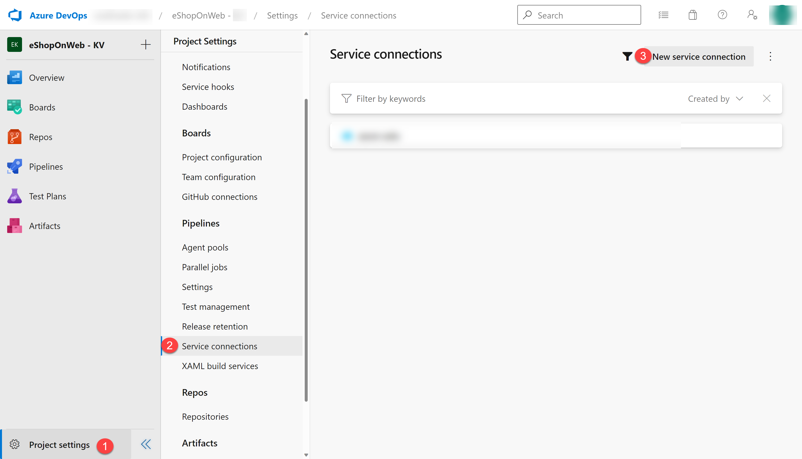
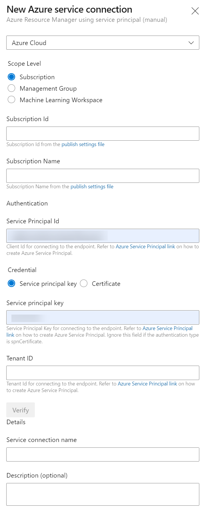

---
lab:
  title: Integración de Azure Key Vault con Azure DevOps
  module: 'Module 05: Implement a secure continuous deployment using Azure Pipelines'
---

# Integración de Azure Key Vault con Azure DevOps

## Manual de laboratorio para alumnos

## Requisitos del laboratorio

- Este laboratorio requiere **Microsoft Edge** o un [explorador compatible con Azure DevOps.](https://learn.microsoft.com/azure/devops/server/compatibility)

- **Configurar una organización de Azure DevOp:**: si aún no tiene una organización Azure DevOps que pueda usar para este laboratorio, cree una siguiendo las instrucciones disponibles en [Creación de una organización o colección de proyectos](https://learn.microsoft.com/azure/devops/organizations/accounts/create-organization).

- Identifique una suscripción de Azure existente o cree una.

## Introducción al laboratorio

Azure Key Vault proporciona un almacenamiento y una administración seguros de los datos confidenciales, como claves, contraseñas y certificados. Azure Key Vault incluye compatibilidad con módulos de seguridad de hardware y una gama de algoritmos de cifrado y longitudes de clave. Haciendo uso de Azure Key Vault puedes minimizar la posibilidad de revelar datos confidenciales a través del código fuente, que es un error común cometido por los desarrolladores. El acceso a Azure Key Vault requiere una autenticación y autorización adecuadas, y admite permisos específicos para su contenido.

En este laboratorio, verás cómo puedes integrar Azure Key Vault con una canalización de Azure Pipelines siguiendo estos pasos:

- Crea un almacén de Azure Key Vault para almacenar una contraseña ACR como secreto.
- Crea una entidad de servicio principal de Azure para proporcionar acceso a los secretos de Azure Key Vault.
- Configure los permisos para permitir que la entidad de servicio lea el secreto.
- Configura la canalización para recuperar la contraseña de Azure Key Vault y pasarla a las tareas posteriores.

## Objetivos

Después de completar este laboratorio, podrá:

- Cree una entidad de servicio de Microsoft Entra.
- Cree un almacén de Azure Key Vault.

## Tiempo estimado: 40 minutos

## Instrucciones

### Ejercicio 0: configuración de los requisitos previos del laboratorio

En este ejercicio, configurarás los requisitos previos para el laboratorio, que consta de un nuevo proyecto de Azure DevOps con un repositorio basado en [eShopOnWeb](https://github.com/MicrosoftLearning/eShopOnWeb).

#### Tarea 1: (omitir si ya la has completado) crear y configurar el proyecto del equipo

En esta tarea, crearás un proyecto de Azure DevOps **eShopOnWeb** que usarán varios laboratorios.

1. En el equipo del laboratorio, en una ventana del explorador, abre la organización de Azure DevOps. Haz clic en **Nuevo proyecto**. Asígnale al proyecto el nombre **eShopOnWeb** y deja los demás campos con los valores predeterminados. Haga clic en **Crear**.

    

#### Tarea 2: (omitir si ya la has completado) importar repositorio de Git eShopOnWeb

En esta tarea, importarás el repositorio de Git eShopOnWeb que usarán varios laboratorios.

1. En el equipo del laboratorio, en una ventana del explorador, abre la organización de Azure DevOps y el proyecto **eShopOnWeb** creado anteriormente. Haz clic en **Repos>Archivos**, **Importar**. En la ventana **Importar un repositorio de Git** pega la siguiente dirección URL https://github.com/MicrosoftLearning/eShopOnWeb.git y haz clic en **Importar**:

    

2. El repositorio se organiza de la siguiente manera:
    - La carpeta **.ado** contiene canalizaciones de YAML de Azure DevOps.
    - El contenedor de carpetas **.devcontainer** está configurado para realizar el desarrollo con contenedores (ya sea localmente en VS Code o GitHub Codespaces).
    - La carpeta **.azure** contiene la infraestructura de Bicep&ARM como plantillas de código usadas en algunos escenarios de laboratorio.
    - La carpeta **.github** contiene definiciones de flujo de trabajo de GitHub YAML.
    - La carpeta **src** contiene el sitio web .NET 7 que se usa en los escenarios de laboratorio.

### Ejercicio 1: Configurar la canalización de CI para crear el contenedor eShopOnWeb.

Configura la canalización de YAML de CI para lo siguiente:

- Crear una instancia de Azure Container Registry para mantener las imágenes del contenedor
- Usar Docker Compose para compilar e insertar imágenes de contenedor **eshoppublicapi** y **eshopwebmvc**. Solo se implementará el contenedor **eshopwebmvc**.

#### Tarea 1: (omite si ya lo has hecho) Crear una entidad de servicio

En esta tarea, crearás una entidad de servicio mediante la CLI de Azure, que permitirá a Azure DevOps realizar lo siguiente:

- Implementar recursos en tu suscripción de Azure
- Tener acceso de lectura a los secretos de Key Vault creados más adelante.

> **Nota**: si ya tienes una entidad de servicio, puedes continuar directamente con la siguiente tarea.

Necesitarás una entidad de servicio para implementar recursos de Azure desde Azure Pipelines. Dado que vamos a recuperar secretos en una canalización, es necesario conceder permiso al servicio al crear Azure Key Vault.

Azure Pipelines crea automáticamente una entidad de servicio cuando se conecta a una suscripción de Azure desde dentro de una definición de canalización o al crear una nueva conexión de servicio desde la página de configuración del proyecto (opción automática). También puedes crear manualmente la entidad de servicio desde el portal o mediante la CLI de Azure y volver a usarla en proyectos.

1. En el equipo del laboratorio, inicia un explorador web, ve a [**Azure Portal**](https://portal.azure.com) e inicia sesión con las credenciales de una cuenta de usuario con el rol Propietario en la suscripción de Azure que vas a usar en este laboratorio, así como el rol Administrador global en el inquilino de Microsoft Entra asociado a esta suscripción.
2. En Azure Portal, haz clic en el icono de **Cloud Shell**, situado inmediatamente a la derecha del cuadro de texto de búsqueda en la parte superior de la página.
3. Si se le pide que seleccione **Bash** o **PowerShell**, seleccione **Bash**.

   >**Nota**: si es la primera vez que inicias **Cloud Shell** y aparece el mensaje **No tiene ningún almacenamiento montado**, selecciona la suscripción que usas en este laboratorio y haz clic en **Crear almacenamiento**.

4. En el símbolo del sistema de **Bash**, en el panel de **Cloud Shell**, ejecuta los siguientes comandos para recuperar los valores del Id. de suscripción de Azure y los atributos de nombre de suscripción:

    ```bash
    az account show --query id --output tsv
    az account show --query name --output tsv
    ```

    > **Nota**: copia ambos valores en un archivo de texto. Los necesitará más adelante en este laboratorio.

5. En el símbolo del sistema **Bash**, en el panel de **Cloud Shell**, ejecuta el siguiente comando para crear una entidad de servicio (reemplaza **myServicePrincipalName** por cualquier cadena única de caracteres que consta de letras y dígitos) y **mySubscriptionID** por tu subscriptionId de Azure:

    ```bash
    az ad sp create-for-rbac --name myServicePrincipalName \
                         --role contributor \
                         --scopes /subscriptions/mySubscriptionID
    ```

    > **Nota**: el comando generará una salida JSON. Copie los resultados en un archivo de texto. Lo necesitará más adelante en este laboratorio.

6. Después, desde el equipo del laboratorio, abre un explorador web y ve al proyecto **eShopOnWeb** de Azure DevOps. Haz clic en **Configuración del proyecto>Conexiones de servicio (en Canalizaciones)** y en **Nueva conexión de servicio**.

    

7. En la hoja **Nueva conexión de servicio**, selecciona **Administrador de recursos de Azure** y luego **Siguiente** (quizá debas desplazarte hacia abajo).

8. Elige **Entidad de servicio (manual)** y haz clic en **Siguiente**.

9. Rellena los campos vacíos con la información recopilada durante los pasos anteriores:
    - Id. y nombre de la suscripción.
    - Id. de entidad del servicio (appId), clave de entidad de servicio (contraseña) e Id. de inquilino (inquilino).
    - En **Nombre de conexión de servicio**, escribe **azure subs**.  Se hará referencia a este nombre en las canalizaciones de YAML cuando necesites una conexión de servicio de Azure DevOps para comunicarte con la suscripción de Azure.

    

10. Haz clic en **Verificar y guardar**.

#### Tarea 2: Configurar y ejecutar la canalización de CI

En esta tarea, importarás una definición de canalización de YAML de CI existente, la modificarás y ejecutarás. Crearás una nueva instancia de Azure Container Registry (ACR) y compilarás o publicarás las imágenes de contenedor eShopOnWeb.

1. En el equipo de laboratorio, inicia un explorador web y ve al proyecto **eShopOnWeb** de Azure DevOps. Ve a **Canalizaciones>Canalizaciones** y haz clic en **Crear canalización** (o **Nueva canalización**).

2. En la ventana **¿Dónde está su código?**, selecciona **Azure Repos Git (YAML)** y selecciona el repositorio **eShopOnWeb**.

3. En la sección **Configurar**, selecciona **Archivo YAML de Azure Pipelines existente**. Proporciona la siguiente ruta de acceso **/.ado/eshoponweb-ci-dockercompose.yml** y haz clic en **Continuar**.

    

4. En la definición de canalización de YAML, personaliza el nombre del grupo de recursos reemplazando **NAME** en **AZ400-EWebShop-NAME** y reemplaza **YOUR-SUBSCRIPTION-ID** por tu propio id. de suscripción de Azure.

5. Haz clic en **Guardar y ejecutar** y espera a que la canalización se ejecute correctamente.

    > **Nota**: La compilación tardará algunos minutos en completarse. La definición de la compilación consta de las siguientes tareas:
    - **AzureResourceManagerTemplateDeployment** usa **bicep** para implementar una instancia de Azure Container Registry.
    - La tarea de **PowerShell** toma la salida de bicep (servidor de inicio de sesión acr) y crea una variable de canalización.
    - La tarea de **DockerCompose** compila e inserta las imágenes de contenedor para eShopOnWeb en Azure Container Registry.

6. La canalización tomará un nombre en función del nombre del proyecto. Permite **cambiarle el nombre** para identificar mejor la canalización. Ve a **Canalizaciones>Canalizaciones** y haz clic en la canalización creada recientemente. Haz clic en los puntos suspensivos y en la opción **Cambiar el nombre/Quitar**. Asígnale el nombre **eshoponweb-ci-dockercompose** y haz clic en **Guardar**.

7. Una vez finalizada la ejecución, en Azure Portal, abre el grupo de recursos definido anteriormente y verás una instancia de Azure Container Registry (ACR) con las imágenes de contenedor creadas, **eshoppublicapi** y **eshopwebmvc** Solo usarás **eshopwebmvc** en la fase de implementación.

    

8. Haz clic en **Claves de acceso** y copia el valor de la **contraseña**. Se usará en la siguiente tarea, ya que lo mantendremos como secreto en Azure Key Vault.

    

#### Tarea 2: Crear una instancia de Azure Key Vault

En esta tarea, crearás una instancia de Azure Key Vault mediante Azure Portal.

En este escenario de laboratorio, tendremos una instancia de Azure Container (ACI) que extrae y ejecuta una imagen de contenedor almacenada en Azure Container Registry (ACR). Tenemos previsto almacenar la contraseña de ACR como un secreto en el almacén de claves.

1. En Azure portal, usa el cuadro de texto **Buscar recursos, servicios y documentos**, en la parte superior de la página de Azure Portal, escribe **Almacén de claves** y presiona la tecla **Entrar**.
2. En la hoja **Almacén de claves**, selecciona **Crear>Almacén de claves**.
3. En la pestaña **Aspectos básicos** de la hoja **Crear almacén de claves**, especifica las siguientes opciones configuración y selecciona **Siguiente**:

    | Configuración | Value |
    | --- | --- |
    | Subscription | nombre de la suscripción de Azure que usa en este laboratorio |
    | Resource group | El nombre de un nuevo grupo de recursos **AZ400-EWebShop-NAME** |
    | Nombre del almacén de claves | Cualquier nombre válido único, como **ewebshop-kv-NAME** (reemplaza NAME) |
    | Region | Una región de Azure más cercana a la ubicación del entorno de laboratorio |
    | Plan de tarifa | **Estándar** |
    | Días durante los cuales se conservarán los almacenes eliminados | **7** |
    | Protección de purgas | **Deshabilitar la protección de purga** |

4. En la pestaña **Configuración de acceso** de la hoja **Crear almacén de claves**, selecciona **Directiva de acceso del almacén** y después en la sección **Directivas de acceso**, haz clic en **+ Crear** para configurar una nueva directiva.

    > **Nota**: Debes proteger el acceso a los almacenes de claves permitiendo el acceso únicamente a aplicaciones y usuarios autorizados. Para acceder a los datos del almacén, deberás facilitar permisos de lectura (Get/List) a la entidad de servicio creada anteriormente que usarás para la autenticación en la canalización. 

    1. En la hoja **Permisos**, debajo de **Permisos de secretos**, marca los permisos **Obtener** y **Lista**. Haga clic en **Siguiente**.
    2. En la hoja **Entidad principal**, busca la **entidad de servicio creada anteriormente**, ya sea mediante el identificador o el nombre especificados y selecciónala en la lista. Haz clic en **Siguiente**, **Siguiente**, **Crear** (directiva de acceso).
    3. En la hoja **Revisar y crear**, haz clic en **Crear**

5. De nuevo en la hoja **Crear un almacén de claves**, haz clic en **Revisar y crear > Crear**.

    > **Nota**: Espera a que se aprovisione Azure Key Vault. Debería tardar menos de un minuto.

6. En la página **Se completó la implementación**, haz clic en **Ir al recurso**.
7. En la hoja Azure Key Vault (ewebshop-kv-NAME), en el menú vertical del lado izquierdo de la hoja, en la sección **Objetos**, haz clic en **Secretos**.
8. En la hoja **Secretos**, haz clic en **Generar e importar**.
9. En la hoja **Crear un secreto**, especifica las siguientes opciones de configuración (deja las demás con los valores predeterminados) y haz clic en **Crear**:

    | Configuración | Valor |
    | --- | --- |
    | Opciones de carga | **Manual** |
    | Nombre | **acr-secret** |
    | Valor | Contraseña de acceso de ACR copiada en la tarea anterior |

#### Tarea 3: Crear un grupo de variables conectado a Azure Key Vault

En esta tarea, crearás un grupo de variables en Azure DevOps que recuperará el secreto de contraseña de ACR de Key Vault mediante la conexión de servicio (entidad de servicio).

1. En el equipo de laboratorio, inicia un explorador web y ve al proyecto **eShopOnWeb** de Azure DevOps.

2. En el panel de navegación vertical del portal de Azure DevOps, selecciona **Canalizaciones>Biblioteca**. Haz clic en **+ Grupo de variables**.

3. En la hoja **Nuevo grupo de variables**, configura las opciones siguientes:

    | Configuración | Valor |
    | --- | --- |
    | Nombre del grupo de variables | **eshopweb-vg** |
    | Vincular secretos desde una instancia de Azure Key Vault | **enable** |
    | Suscripción de Azure | **Conexiones disponibles del servicio de Azure > Suscripciones de Azure** |
    | Nombre del almacén de claves | Nombre del almacén de claves|

4. En **Variables**, haz clic en **+ Agregar** y selecciona el secreto **acr-secret**. Haga clic en **Aceptar**.
5. Haga clic en **Guardar**.

    

#### Tarea 4: Configurar la canalización de CD para implementar el contenedor en Azure Container Instances (ACI)

En esta tarea, importarás una canalización de CD, la personalizarás y la ejecutarás para implementar la imagen de contenedor creada antes en Azure Container Instances.

1. En el equipo de laboratorio, inicia un explorador web y ve al proyecto **eShopOnWeb** de Azure DevOps. Ve a **Canalizaciones>Canalizaciones** y haz clic en **Nueva canalización**.

2. En la ventana **¿Dónde está su código?**, selecciona **Azure Repos Git (YAML)** y selecciona el repositorio **eShopOnWeb**.

3. En la sección **Configurar**, selecciona **Archivo YAML de Azure Pipelines existente**. Proporciona la siguiente ruta de acceso **/.ado/eshoponweb-cd-aci.yml** y haz clic en **Continuar**.

4. En la definición de canalización de YAML, personaliza lo siguiente:

    - **YOUR-SUBSCRIPTION-ID** con el identificador de tu suscripción de Azure.
    - **az400eshop-NAME**, reemplaza NAME para que sea único globalmente.
    - **YOUR-ACR.azurecr.io** y **ACR-USERNAME** con el servidor de inicio de sesión de ACR (ambos necesitan el nombre de ACR y se pueden revisar en ACR>Claves de acceso).
    - **AZ400-EWebShop-NAME** con el nombre del grupo de recursos definido antes en el laboratorio.

5. Haz clic en **Guardar y ejecutar**.
6. Abre la canalización y espera a que se ejecute correctamente.

    > **Importante**: si ves el mensaje "Esta canalización necesita permiso para acceder a un recurso para que esta ejecución pueda pasar a Docker Compose a ACI", haz clic en Ver, Permitir y Permitir nuevamente. Esto es necesario para permitir que la canalización cree el recurso.

    > **Nota**: La implementación puede tardar unos minutos en completarse. La definición de CD consta de las siguientes tareas:
    - **Recursos**: está preparado para desencadenarse automáticamente en función de la finalización de la canalización de CI. También descarga el repositorio para el archivo bicep.
    - **Variables (para la fase de implementación)** se conecta al grupo de variables para consumir el secreto **acr-secret** de Azure Key Vault.
    - **AzureResourceManagerTemplateDeployment** implementa Azure Container Instances (ACI) mediante la plantilla de bicep y proporciona los parámetros de inicio de sesión de ACR para permitir que ACI descargue la imagen de contenedor creada anteriormente desde Azure Container Registry (ACR).

7. La canalización tomará un nombre en función del nombre del proyecto. Permite **cambiarle el nombre** para identificar mejor la canalización. Ve a **Canalizaciones>Canalizaciones** y haz clic en la canalización creada recientemente. Haz clic en los puntos suspensivos y en la opción **Cambiar de nombre o mover**. Asígnale el nombre **eshoponweb-cd-aci** y haz clic en **Guardar**.

### Ejercicio 2: Quitar los recursos del laboratorio de Azure

En este ejercicio, quitarás los recursos de Azure aprovisionados en este laboratorio para eliminar cargos inesperados.

>**Nota**: No olvide quitar los recursos de Azure recién creados que ya no use. La eliminación de los recursos sin usar garantiza que no verá cargos inesperados.

#### Tarea 1: eliminar los recursos del laboratorio de Azure

En esta tarea, usarás Azure Cloud Shell para quitar los recursos de Azure aprovisionados en este laboratorio con el propósito de eliminar cargos innecesarios.

1. En Azure Portal, abre el grupo de recursos y haz clic en **Eliminar grupo de recursos**.

## Revisar

En este laboratorio, integraste Azure Key Vault con una canalización de Azure DevOps siguiendo estos pasos:

- Creaste una entidad de servicio de Azure para proporcionar acceso a un secreto de Azure Key Vault y autenticar la implementación en Azure desde Azure DevOps.
- Ejecutaste dos canalizaciones de YAML importadas desde un repositorio de Git.
- Configuraste una canalización para recuperar la contraseña de Azure Key Vault mediante un grupo de variables y la usaste en tareas posteriores.
