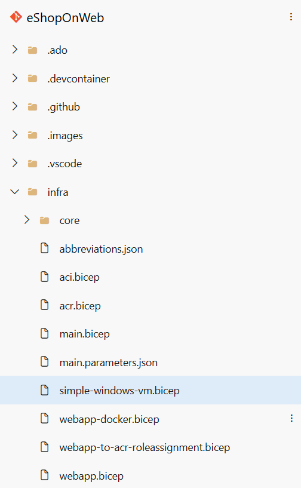
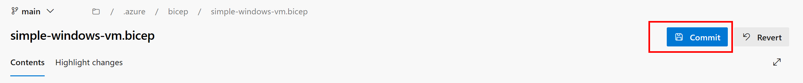

---
lab:
  title: Implementaciones mediante plantillas de Azure Bicep
  module: 'Module 05: Manage infrastructure as code using Azure and DSC'
---

# Implementaciones mediante plantillas de Azure Bicep

## Requisitos del laboratorio

- Este laboratorio requiere **Microsoft Edge** o un [explorador compatible con Azure DevOps](https://docs.microsoft.com/azure/devops/server/compatibility).

- **Configurar una organización de Azure DevOp:**: si aún no tiene una organización Azure DevOps que pueda usar para este laboratorio, cree una siguiendo las instrucciones disponibles en [Creación de una organización o colección de proyectos](https://docs.microsoft.com/azure/devops/organizations/accounts/create-organization).

- Identifique una suscripción de Azure existente o cree una.

- Compruebe que tiene una cuenta Microsoft o una cuenta de Microsoft Entra con el rol Propietario en la suscripción de Azure y el rol Administrador global en el inquilino de Microsoft Entra asociado a la suscripción de Azure. Para más información, consulte [Enumeración de asignaciones de roles de Azure mediante Azure Portal](https://docs.microsoft.com/azure/role-based-access-control/role-assignments-list-portal) y [Ver y asignar roles de administrador en Azure Active Directory](https://docs.microsoft.com/azure/active-directory/roles/manage-roles-portal).

## Introducción al laboratorio

En este laboratorio, crearás una plantilla de Azure Bicep y la modularizarás mediante el concepto de módulos de Azure Bicep. Después, modificarás la plantilla de implementación principal para usar el módulo y, por último, implementarás todos los recursos en Azure.

## Objetivos

Después de completar este laboratorio, podrá:

- Entender la estructura de una plantilla de Azure Bicep.
- Crear un módulo de Bicep reutilizable.
- Modificar la plantilla principal para usar el módulo
- Implementar todos los recursos en Azure mediante canalizaciones de YAML de Azure.

## Tiempo estimado: 45 minutos

## Instrucciones

### Ejercicio 0: (omitir si se ha realizado) Configuración de los requisitos previos del laboratorio

En este ejercicio, configurarás los requisitos previos para el laboratorio, lo que supone crear un nuevo proyecto de Azure DevOps con un repositorio basado en [eShopOnWeb](https://github.com/MicrosoftLearning/eShopOnWeb).

#### Tarea 1: (omitir si ya la has completado) crear y configurar el proyecto del equipo

En esta tarea, crearás un proyecto de **eShopOnWeb** de Azure DevOps que se usará en varios laboratorios.

1. En el equipo del laboratorio, en una ventana del explorador, abre la organización de Azure DevOps. Haz clic en **Nuevo proyecto**. Asígnale al proyecto el nombre **eShopOnWeb** y deja los demás campos con los valores predeterminados. Haga clic en **Crear**.

    

#### Tarea 2: (omitir si ha terminado) Importar repositorio de Git eShopOnWeb

En esta tarea, importarás el repositorio de Git eShopOnWeb que se usará en varios laboratorios.

1. En el equipo del laboratorio, en una ventana del explorador, abre la organización de Azure DevOps y el proyecto **eShopOnWeb** creado anteriormente. Haz clic en **Repos>Archivos**, **Importar un repositorio**. Seleccione **importar**. En la ventana **Importar un repositorio de Git**, pega la siguiente dirección URL <https://github.com/MicrosoftLearning/eShopOnWeb.git> y haz clic en **Importar**:

    

1. El repositorio se organiza de la siguiente manera:
    - La carpeta **.ado** contiene canalizaciones de YAML de Azure DevOps.
    - El contenedor de carpetas **.devcontainer** está configurado para realizar el desarrollo con contenedores (ya sea localmente en VS Code o GitHub Codespaces).
    - La carpeta **infra** contiene la infraestructura de Bicep y ARM como plantillas de código usadas en algunos escenarios de laboratorio.
    - Definiciones de flujo de trabajo de GitHub del contenedor de carpetas **.github**.
    - La carpeta **src** contiene el sitio web de .NET 8 que se usa en los escenarios de laboratorio.

#### Tarea 3: (omitir si ya la has completado) Establecer la rama principal como rama predeterminada

1. Ve a **Repos > Ramas**.
1. Mantén el puntero sobre la rama **main** y haz clic en los puntos suspensivos a la derecha de la columna.
1. Haz clic en **Establecer como rama predeterminada**.

### Ejercicio 1: entender una plantilla de Azure Bicep y simplificarla mediante un módulo reutilizable

En este laboratorio, revisarás una plantilla de Azure Bicep y la simplificarás mediante un módulo reutilizable.

#### Tarea 1: Creación de plantillas de Azure Bicep

En esta tarea, usará Visual Studio Code para crear una plantilla de Azure Bicep.

1. En la pestaña del explorador que tiene abierto el proyecto de Azure DevOps, ve a **Repos** y **Archivos**. Abre la carpeta `infra` y busca el archivo `simple-windows-vm.bicep`.

   

1. Revisa la plantilla para comprender mejor su estructura. Hay algunos parámetros con tipos, valores predeterminados y validación, algunas variables y bastantes recursos con estos tipos:

   - Microsoft.Storage/storageAccounts
   - Microsoft.Network/publicIPAddresses
   - Microsoft.Network/virtualNetworks
   - Microsoft.Network/networkInterfaces
   - Microsoft.Compute/virtualMachines

1. Presta atención a lo sencillo que son las definiciones de recursos y a la capacidad de hacer referencia implícitamente a nombres simbólicos en lugar de explícitos `dependsOn` en toda la plantilla.

#### Tarea 2: Crear un módulo de bicep reutilizable para los recursos de almacenamiento

En esta tarea, crearás un módulo de plantilla de almacenamiento **storage.bicep** que creará solo una cuenta de almacenamiento y la importará la plantilla principal. El módulo de plantilla de almacenamiento debe volver a pasar un valor a la plantilla principal, **main.bicep**, y este valor se definirá en el elemento outputs del módulo de plantilla de almacenamiento.

1. En primer lugar, es necesario quitar el recurso de almacenamiento de nuestra plantilla principal. En la esquina superior derecha de la ventana del explorador, haz clic en el botón **Editar**:

   

1. Ahora elimina el recurso de almacenamiento:

   ```bicep
   resource storageAccount 'Microsoft.Storage/storageAccounts@2022-05-01' = {
     name: storageAccountName
     location: location
     sku: {
       name: 'Standard_LRS'
     }
     kind: 'Storage'
   }
   ```

1. Sin embargo, confirma el archivo. Aún no hemos terminado con él.

   

1. A continuación, mantenga el mouse sobre la `Infra` carpeta y haga clic en el icono de puntos suspensivos, seleccione **Nuevo**y **Archivo**. Escribe **`storage.bicep`** para el nombre y haz clic en **Crear**.

   

1. Ahora copia el siguiente fragmento de código en el archivo y confirma los cambios:

   ```bicep
   @description('Location for all resources.')
   param location string = resourceGroup().location

   @description('Name for the storage account.')
   param storageAccountName string

   resource storageAccount 'Microsoft.Storage/storageAccounts@2022-05-01' = {
     name: storageAccountName
     location: location
     sku: {
       name: 'Standard_LRS'
     }
     kind: 'Storage'
   }

   output storageURI string = storageAccount.properties.primaryEndpoints.blob
   ```

#### Tarea 3: Modificar la plantilla principal para usar el módulo de plantilla

En esta tarea, modificarás la plantilla principal para hacer referencia al módulo de plantilla que creaste en la tarea anterior.

1. Vuelve a navegar al archivo `simple-windows-vm.bicep` y haz clic de nuevo en el botón **Editar**.

1. A continuación, agrega el siguiente código después de las variables:

   ```bicep
   module storageModule './storage.bicep' = {
     name: 'linkedTemplate'
     params: {
       location: location
       storageAccountName: storageAccountName
     }
   }
   ```

1. También es necesario modificar la referencia al URI del blob de la cuenta de almacenamiento en nuestro recurso de máquina virtual para usar la salida del módulo en su lugar. Busca el recurso de máquina virtual y reemplaza la sección diagnosticsProfile por lo siguiente:

   ```bicep
   diagnosticsProfile: {
     bootDiagnostics: {
       enabled: true
       storageUri: storageModule.outputs.storageURI
     }
   }
   ```

1. En la plantilla se solicitan los siguientes detalles:

   - Un recurso en la plantilla principal se usa para vincular a otra plantilla.
   - El módulo tiene un nombre simbólico denominado `storageModule`. Este nombre de usa para configurar cualquier dependencia.
   - Al usar módulos de plantilla, solo puedes usar el modo de implementación **incremental**.
   - Se usa una ruta de acceso relativa para el módulo de plantilla.
   - Usa parámetros para pasar valores de la plantilla principal a la plantilla vinculada.

1. Confirma la plantilla.

### Ejercicio 2: Implementación de las plantillas en Azure mediante canalizaciones de YAML

En este laboratorio, crearás una canalización de YAML de Azure DevOps para implementar la plantilla en tu entorno de Azure.

#### Tarea 1: Implementación de los recursos en Azure mediante canalizaciones de YAML

1. Vuelve al panel **Canalizaciones** del centro de **Canalizaciones**.
1. En la ventana **Crear la primera canalización**, haz clic en **Crear canalización**.

    > **Nota**: usaremos el asistente para crear una nueva definición de canalización de YAML basada en nuestro proyecto.

1. En el panel **¿Dónde está el código?**, haz clic en la opción **Azure Repos Git (YAML)**.
1. En el panel **Seleccionar un repositorio**, haz clic en **eShopOnWeb**.
1. En el panel **Configurar tu canalización**, desplázate hacia abajo y selecciona **Archivo YAML de Azure Pipelines existente**.
1. En la hoja **Seleccionar un archivo YAML existente**, especifica los parámetros siguientes:
   - Rama: **principal**.
   - Ruta de acceso: **.ado/eshoponweb-cd-windows-cm.yml**
1. Haz clic en **Continuar** para guardar esta configuración.
1. En la sección variables, elige un nombre para el grupo de recursos, establece la ubicación que quieres y reemplaza el valor de la conexión de servicio por una de las conexiones de servicio existentes que has creado anteriormente.
1. Haz clic en el botón **Guardar y ejecutar** de la esquina superior derecha y, cuando aparezca el cuadro de diálogo de confirmación, haz clic en **Guardar y ejecutar** de nuevo.

   

1. Espere a que finalice la implementación y revise los resultados.
   

   > [!IMPORTANT]
   > Recuerda eliminar los recursos creados en Azure Portal para evitar cargos innecesarios.

## Revisar

En este laboratorio, has aprendido a crear una plantilla de Azure Bicep, modularizarla mediante un módulo de plantilla, modificar la plantilla de implementación principal para usar el módulo y las dependencias actualizadas y, por último, implementar las plantillas en Azure mediante canalizaciones de YAML.
