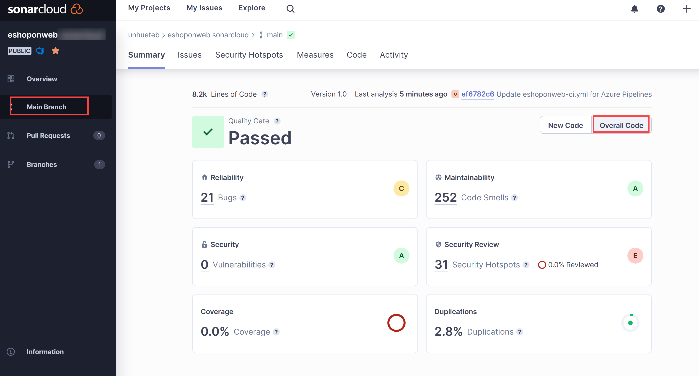

---
lab:
  title: Administración de la deuda técnica con Azure DevOps y SonarCloud
  module: 'Module 07: Implement security and validate code bases for compliance'
---

# Administración de la deuda técnica con Azure DevOps y SonarCloud

## Manual de laboratorio para alumnos

## Requisitos del laboratorio

- Este laboratorio requiere **Microsoft Edge** o un [explorador compatible con Azure DevOps](https://docs.microsoft.com/azure/devops/server/compatibility).

- **Configurar una organización de Azure DevOp:**: si aún no tiene una organización Azure DevOps que pueda usar para este laboratorio, cree una siguiendo las instrucciones disponibles en [Creación de una organización o colección de proyectos](https://docs.microsoft.com/azure/devops/organizations/accounts/create-organization).

## Introducción al laboratorio

En el contexto de Azure DevOps, el término **deuda técnica** representa medios poco óptimos de alcanzar objetivos tácticos, lo que afecta negativamente a la capacidad de lograr objetivos estratégicos en el desarrollo y la implementación de software. La deuda técnica afecta a la productividad porque hace que el código sea difícil de entender, propenso a los fallos, lento de cambiar y difícil de validar. Sin una supervisión y administración adecuadas, la deuda técnica puede acumularse a lo largo del tiempo y afectar significativamente a la calidad general del software y la productividad de los equipos de desarrollo a largo plazo.

[SonarCloud](https://sonarcloud.io/){:target="\_blank"} es un servicio de seguridad y calidad del código basado en la nube. Las principales características de SonarCloud incluyen:

- Compatibilidad con 23 lenguajes de programación y scripting, incluidos Java, JS, C#, C/C++, Objective-C, TypeScript, Python, ABAP, PLSQL y T-SQL.
- Hay miles de reglas para hacer un seguimiento de los errores y problemas de calidad difíciles de encontrar, basadas en eficaces analizadores de código estático.
- Integraciones basadas en la nube con servicios de CI populares, como Travis, Azure DevOps, BitBucket y AppVeyor.
- Análisis profundo del código para explorar todos los archivos de origen en ramas y solicitudes de incorporación de cambios, con lo que resulta más sencillo encontrar una puerta de calidad verde y promover la compilación.
- Velocidad y escalabilidad.

En este laboratorio, aprenderá a integrar Azure DevOps con SonarCloud.

> **Nota**: antes de ejecutar este laboratorio, asegúrate de que puedes ejecutar Azure Pipelines. Debido al cambio en los proyectos públicos que tuvo lugar en febrero de 2021, será necesario solicitar el acceso a las canalizaciones: <https://devblogs.microsoft.com/devops/change-in-azure-pipelines-grant-for-public-projects/>

## Objetivos

Después de completar este laboratorio, podrá:

- Configurar un proyecto de Azure DevOps y una compilación de CI para integrarse con SonarCloud.
- Analizar los informes de SonarCloud.
- Integrar el análisis estático en el proceso de solicitud de incorporación de cambios de Azure DevOps.

## Tiempo estimado: 60 minutos

## Instrucciones

### Ejercicio 0: configuración de los requisitos previos del laboratorio

En este ejercicio, configurarás los requisitos previos para el laboratorio, lo que supone crear un nuevo proyecto de Azure DevOps con un repositorio basado en [eShopOnWeb](https://github.com/MicrosoftLearning/eShopOnWeb).

#### Tarea 1: (omitir si ya la has completado) crear y configurar el proyecto del equipo

En esta tarea, crearás un proyecto de **eShopOnWeb** de Azure DevOps que se usará en varios laboratorios.

1. En el equipo del laboratorio, en una ventana del explorador, abre la organización de Azure DevOps. Haz clic en **Nuevo proyecto**. Asígnale al proyecto el nombre **eShopOnWeb** y elige **Scrum** en la lista desplegable **Proceso del elemento de trabajo**. Haga clic en **Crear**.

    

#### Tarea 2: (omitir si ha terminado) Importar repositorio de Git eShopOnWeb

En esta tarea, importarás el repositorio de Git eShopOnWeb que se usará en varios laboratorios.

1. En el equipo del laboratorio, en una ventana del explorador, abre la organización de Azure DevOps y el proyecto **eShopOnWeb** creado anteriormente. Haz clic en **Repos>Archivos**, **Importar**. En la ventana **Importar un repositorio de Git**, pega la siguiente dirección URL https://github.com/MicrosoftLearning/eShopOnWeb.git y haz clic en **Importar**:

    

2. El repositorio se organiza de la siguiente manera:
    - La carpeta **.ado** contiene canalizaciones de YAML de Azure DevOps.
    - El contenedor de carpetas **.devcontainer** está configurado para desarrollar con contenedores (ya sea localmente en VS Code o GitHub Codespaces).
    - La carpeta **.azure** contiene la infraestructura de Bicep&ARM como plantillas de código usadas en algunos escenarios de laboratorio.
    - La carpeta **.github** contiene definiciones de flujo de trabajo de GitHub YAML.
    - La carpeta **src** contiene el sitio web .NET 7 que se usa en los escenarios de laboratorio.

### Ejercicio 1: Configuración de Sonarcloud

#### Tarea 1: cambiar el proyecto de Azure DevOps a público

En esta tarea, cambiarás la visibilidad del proyecto de Azure DevOps a público, ya que Sonarcloud es gratuito para los proyectos de ADO públicos.

1. En el equipo de laboratorio, en la ventana del explorador web que muestra el portal de Azure DevOps, abre el proyecto **eShopOnWeb** y haz clic en **Configuración del proyecto** (esquina inferior izquierda). Cambia la **Visibilidad** a **Público**. Haga clic en **Guardar**


#### Tarea 2: generar un token de acceso personal de Azure DevOps

En esta tarea, generarás un token de acceso personal de Azure DevOps que se usará para autenticar desde la aplicación Postman que instalarás en la siguiente tarea de este ejercicio.

1. En el equipo del laboratorio, en la ventana del explorador web que muestra el portal de Azure DevOps, en la esquina superior derecha de la página de Azure DevOps, haz clic en el icono **Configuración de usuario**; en el menú desplegable, haz clic en **Tokens de acceso personal** y en el panel **Tokens de acceso personal**, haz clic en **+ Nuevo token**.

    

2. En el panel **Crear un nuevo token de acceso personal**, haz clic en el vínculo **Mostrar todos los ámbitos**, especifica la siguiente configuración y haz clic en **Crear** (deja las demás opciones con sus valores predeterminados):

     | Configuración | Value |
     | --- | --- |
     | Nombre | **Administración de la deuda técnica con Azure DevOps y SonarCloud** |
     | Ámbitos | **Definido por el usuario** |
     | Ámbito | **Código** |
     | Permisos | **Completa** |

3. En el panel **Correcto**, copia el valor del token de acceso personal en el portapapeles.

     > **Nota**: asegúrate de registrar el valor del token. No podrás recuperarlo cuando cierres este panel.

4. En el panel **Correcto**, haz clic en **Cerrar**.

#### Tarea 3: instalar y configurar la extensión SonarCloud Azure DevOps

En esta tarea, instalarás y configurarás la extensión SonarCloud Azure DevOps en tu proyecto de Azure DevOps.

1. En el equipo de laboratorio, inicia un explorador web, ve a la [página de extensión de SonarCloud](https://marketplace.visualstudio.com/items?itemName=SonarSource.sonarcloud) en Visual Studio Marketplace, haz clic en **Obtenerla gratis**, asegúrate de que el nombre de la organización de Azure DevOps aparezca en la lista desplegable **Seleccionar una organización de Azure Devops** y haz clic en **Instalar**.
2. Una vez completada la instalación, haz clic en **Continuar con la organización**. Esto redirigirá el explorador al portal de Azure DevOps que muestra la página principal de la organización.

    > **Nota**: si no tienes los permisos adecuados para instalar una extensión desde Marketplace, se enviará una solicitud al administrador de la cuenta para pedirle que apruebe la instalación.

    > **Nota**: la extensión SonarCloud contiene tareas de compilación, plantillas de compilación y un widget de panel personalizado.

3. En la ventana del explorador web, ve a la **página principal de SonarCloud**[https://sonarcloud.io/](https://sonarcloud.io/).
4. En la página principal de SonarCloud, haz clic en **Iniciar sesión**.
5. En **Iniciar sesión o registrarse en SonarCloud**, haz clic en **Azure DevOps**.
6. Cuando el sistema pregunte **¿Quieres dejar que esta aplicación acceda a tu información?**, haz clic en **Sí**. Si corresponde, selecciona **Consentimiento en nombre de la organización** y **Aceptar**.

    > **Nota**: en SonarCloud, crearás una organización y un nuevo proyecto dentro de ella. La organización y el proyecto que has configurado en SonarCloud reflejarán la organización y el proyecto que se ha configurado en Azure DevOps.

7. Haz clic en **Importar una organización desde Azure**.

    

8. En la página **Crear una organización**, en el **nombre de la organización de Azure DevOps**, escribe el nombre de la organización de Azure DevOps. En el cuadro de texto **Token de acceso personal**, pega el valor del token de Azure DevOps que se ha registrado en la tarea anterior y haz clic en **Continuar**. **Sonarcloud usará este token para analizar el código hospedado en Azure DevOps**

9. En la sección **Importar detalles de la organización**, en el cuadro de texto **Clave**, escribe una cadena de caracteres que designe la organización de Sonarcloud, asígnale el mismo nombre que la organización de Azure DevOps y haz clic en **Continuar**.

    > **Nota**: la clave debe ser única dentro del sistema SonarCloud. Asegúrate de que la marca de verificación verde aparezca a la derecha del cuadro de texto **Clave**. Esto indica que la clave cumple los requisitos previos de unicidad.

10. En la sección **Elegir un plan**, selecciona el plan que quieres usar para este laboratorio (**gratis**) y haz clic en **Crear organización**.

    > **Nota**: ahora has creado la organización SonarCloud que refleja la organización de Azure DevOps.

    > **Nota**: a continuación, dentro de la organización recién creada, crearás un proyecto de SonarCloud que reflejará el proyecto de Azure DevOps **SonarExamples**.

11. En la página **Analizar proyectos: seleccionar repositorios**, en la lista de proyectos de Azure DevOps, active la casilla situada junto a la entrada **eshoponweb / eshoponweb** y haga clic en **Configurar**.
12. En la página **Elegir el método de análisis**, haz clic en el mosaico **Con canalizaciones de Azure DevOps**.

    

    > **Nota**: puedes omitir la creación de extensiones si ya la has instalado.

13. En la página **Analizar un proyecto con Azure Pipelines**, en la página **Agregar un nuevo punto de conexión de servicio Sonarcloud**, sigue los pasos mencionados **en el proyecto de Azure DevOps**, asigna el nombre **SonarSC** a la conexión de servicio, **activa** la casilla para conceder acceso a todas las canalizaciones y haz clic en **Comprobar y guardar**.

    

    > **Nota**: en este paso se define cómo se comunicará la canalización de Azure con Sonarcloud. Sonarcloud proporciona un token que usan las canalizaciones para comunicarse con el servicio.

14. En el equipo de laboratorio, en el proyecto de Azure DevOps **eShopOnWeb**, en la barra de menús vertical a la izquierda, ve a la sección **Canalizaciones > Canalizaciones**, y haz clic en **Crear canalización** (o en **Nueva canalización**).

15. En la ventana **¿Dónde está el código?**, selecciona **Azure Repos Git (YAML)** y selecciona el repositorio **eShopOnWeb**.

16. En la sección **Configurar**, selecciona **Archivo YAML de Azure Pipelines existente**. Proporciona la siguiente ruta de acceso **/.ado/eshoponweb-sonar-ci.yml** y haz clic en **Continuar**. Revisa la canalización con los detalles mencionados en el paso siguiente **(se deben reemplazar algunos ajustes)**

17. Cuando vuelvas al sitio web de Sonarcloud, en la página **Analizar un proyecto con Azure Pipelines**, en la sección **Configurar Azure Pipelines**, haz clic en **.NET**. Verás una secuencia de pasos necesarios para **preparar la configuración de análisis**, **ejecutar el análisis de código** y **publicar los resultados de las validaciones de calidad**. Necesitarás estas instrucciones para **modificar la tarea "Preparar configuración de análisis" en la canalización de YAML proporcionada en el paso anterior**.

18. Una vez modificada la canalización, haz clic en **Ejecutar**.

    

19. Es posible que debas cambiar la **visibilidad** del proyecto de Azure DevOps a **Privado** para que los agentes ejecuten la canalización (Configuración del proyecto > Información general).

20. En Azure DevOps, ve a  **Canalizaciones > Canalizaciones** y haz clic en la canalización creada recientemente, y cambia su nombre a **eshoponweb-sonar-ci**.

    

#### Tarea 3: comprobar los resultados de la canalización

En esta tarea, comprobarás los resultados de la canalización.

1. Espera a que finalice la ejecución de la canalización, revisa el contenido de la pestaña **Resumen** y luego haz clic en el encabezado de pestaña **Extensiones**.

    > **Nota**: no habrá información sobre la validación de calidad (Ninguna), ya que todavía no la configuramos en Sonarcloud.

2. En la pestaña **Extensiones**, haz clic en el **informe SonarCloud detallado**. Se abrirá automáticamente una nueva pestaña del explorador que muestre el informe en la página del proyecto SonarCloud.

    > **Nota**: o bien, puedes ir a tu proyecto de SonarCloud.

3. Comprueba que el informe no incluya los resultados de validación de calidad y busca el motivo de su ausencia.

    > **Nota**: para poder ver el resultado de la validación de calidad, después de ejecutar el primer informe, es necesario establecer una **Nueva definición de código**. De este modo, las ejecuciones posteriores de canalización tendrán los resultados de la validación de calidad. **La validación de calidad predeterminada se asegurará de que no haya ninguna nueva vulnerabilidad o error en el código, ignorando las existentes. Puedes crear tus validaciones de calidad personalizadas.**

4. Haz clic en **Establecer nueva definición de código** y selecciona **Versión anterior**.

    

5. Ve al explorador web en el **portal de Azure DevOps** con la ejecución de compilación más reciente. Haz clic en **Ejecutar nuevo** y, en el panel **Ejecutar canalización**, haz clic en **Ejecutar**.
6. En el panel de ejecución de compilación, revisa el contenido de la pestaña **Resumen** y después haz clic en el encabezado de pestaña **Extensiones**.
7. En la pestaña **Extensiones**, haz clic en el **informe SonarCloud detallado**. Se abrirá automáticamente una nueva pestaña del explorador que muestre el informe en la página del proyecto SonarCloud.
8. Comprueba que el informe y la pestaña de **extensión** de Azure DevOps ahora **incluyan el resultado las validaciones de calidad**.

    

### Ejercicio 2: análisis de informes de SonarCloud

En este ejercicio, analizarás los informes de SonarCloud.

#### Tarea 1: analizar los informes de SonarCloud

En esta tarea, analizarás los informes de SonarCloud.

1. En la pestaña **Información general** del proyecto SonarCloud, vemos un resumen del informe sobre la ** evolución de la rama principal**. Si haces clic en el icono de **rama principal** (columna izquierda) y eliges **Código general**, verás un informe más detallado.

    

    > **Nota**: la página tiene métricas como **Código en mal estado**, **Cobertura**, **Duplicaciones** y **Tamaño** (líneas de código). En la tabla siguiente se explican estos términos.

    | Términos | Descripción |
    | --- | --- |
    | **Errores** | Un problema que representa un error en el código. Si esto aún no se ha roto, lo hará. Y probablemente lo haga en el peor momento posible. Esto debe corregirse |
    | **Vulnerabilidades** | Un problema relacionado con la seguridad que podría representar un acceso para los atacantes |
    | **Código en mal estado** | Un problema relacionado con la capacidad de mantenimiento del código. Dejarlo tal cual significa que, en el mejor de los casos, los responsables del mantenimiento tendrán más dificultad para hacer cambios posteriores. En el peor de los casos, estarán tan confundidos por el estado del código que introducirán errores adicionales a medida que hagan cambios. |
    | **Coverage** | Una indicación del porcentaje de código que se está validando mediante, por ejemplo, pruebas unitarias. Para protegerte con eficacia de los errores, las pruebas deberían verificar o "cubrir" una proporción considerable del código. |
    | **Duplicaciones** | La decoración de duplicaciones muestra qué partes del código fuente se duplican |
    | **Puntos conflictivos de seguridad** | Código sensible a la seguridad que requiere una revisión manual para evaluar si existe o no una vulnerabilidad |

2. Haz clic en el número que designa el recuento de **Errores**. Esto mostrará automáticamente el contenido de la pestaña **Problemas**.
3. En el lado derecho de la pestaña **Problemas**, haz clic para ver los errores. Lee la descripción y la información que se proporcionan para analizar y resolver el error.

4. Mantén el puntero del mouse sobre las líneas rojas verticales entre el código y los números de línea para identificar huecos en la cobertura de código.

    > **Nota**: nuestro proyecto de ejemplo es muy pequeño y no tiene datos históricos. Sin embargo, hay miles de [proyectos públicos en SonarCloud](https://sonarcloud.io/explore/projects) que tienen resultados más interesantes y realistas.

### Ejercicio 3: implementación de la integración de solicitudes de incorporación de cambios de Azure DevOps con SonarCloud

En este ejercicio, configurará la integración de solicitudes de incorporación de cambios entre Azure DevOps y SonarCloud.

> **Nota**: para configurar el análisis de SonarCloud para realizar análisis del código en una solicitud de incorporación de cambios de Azure DevOps, debes hacer las siguientes tareas:

- Agrega un token de acceso personal de Azure DevOps a un proyecto de SonarCloud, que autoriza tu acceso a las solicitudes de incorporación de cambios (ya creadas en este laboratorio).
- Configuración de una directiva de rama de Azure DevOps que controla una compilación desencadenada por la solicitud de incorporación de cambios

#### Tarea 1: configurar la integración de solicitudes de incorporación de cambios en SonarCloud

En esta tarea, configurarás la integración de solicitudes de incorporación de cambios en SonarCloud mediante la asignación de un token de acceso personal de Azure DevOps al proyecto de SonarCloud.

1. Ve a la ventana del explorador web que muestra el proyecto **eShopOnWeb** en **SonarCloud**.
2. En la página del panel del proyecto, haz clic en el icono de la pestaña **Administración** y, en el menú desplegable, haz clic en **Configuración general**.
3. En la página **Configuración general**, haz clic en **Solicitudes de incorporación de cambios**.
4. En la sección **General** de la configuración de **solicitudes de incorporación de cambios**, en la lista desplegable **Proveedor**, selecciona **Azure DevOps Services** y haz clic en **Guardar**.
5. En la sección **Integración con Azure DevOps Services** de la configuración de **solicitudes de incorporación de cambios**, en el cuadro de texto **Token de acceso personal**, pega el token de acceso personal de Azure DevOps generado anteriormente y haz clic en **Guardar**.

    

#### Tarea 2: configurar una directiva de rama para la integración con SonarCloud

En esta tarea, configurarás una directiva de rama de Azure DevOps para la integración con SonarCloud.

1. Ve a la ventana del explorador web en la que aparece el proyecto **eShopOnWeb** en el **portal de Azure DevOps**.
2. En la barra de menús vertical situada a la izquierda del portal de Azure DevOps, haz clic en **Repos** y, en la sección **Repos**, haz clic en **Ramas**.
3. En el panel **Ramas**, en la lista de ramas, mantén el puntero del mouse sobre el borde derecho de la entrada de rama **main** para ver los puntos suspensivos verticales del menú **Más opciones**. Haz clic en él y, en el menú emergente, haz clic en **Directivas de rama**.
4. En el panel **principal**, a la derecha de la sección **Compilar la validación**, haz clic en **+**.
5. En el panel **Agregar directiva de compilación**, en la lista desplegable **Compilar canalización**, selecciona la canalización que has creado en este laboratorio. En el cuadro de texto **Nombre para mostrar**, escribe **Análisis de SonarCloud** y haz clic en **Guardar**.

    > **Nota**: Azure DevOps ahora está configurado para desencadenar un análisis de SonarCloud cuando se crea cualquier solicitud de incorporación de cambios destinada a la rama **main**.

#### Tarea 4: validar la integración de solicitudes de incorporación de cambios

En esta tarea, validarás la integración de solicitudes de incorporación de cambios entre Azure DevOps y SonarCloud creando una solicitud de incorporación de cambios y revisando el resultado.

> **Nota**: realizarás un cambio en un archivo del repositorio y crearás una solicitud para desencadenar el análisis de SonarCloud.

1. En el portal de Azure DevOps, en la barra de menús vertical a la izquierda, haz clic en **Repos**. Verás el panel **Archivos**.
2. En el panel central, en la jerarquía de carpetas, ve al archivo **Program.cs** en la carpeta ** src/Web/Services/BasketViewModelService.cs** y haz clic en **Editar**.
3. En el panel **BasketViewModelService.cs**, agrega el siguiente método vacío al código justo antes del último "}":

    ```csharp
    public void Unused(){

    }
    ```

4. En el panel **Program.cs**, haz clic en **Confirmar**.
5. En el panel **Confirmar**, en el cuadro de texto **Nombre de rama**, escribe **branch1**, selecciona la casilla **Crear una solicitud de incorporación de cambios** y haz clic en **Confirmar**.

    

6. En el panel **Nueva solicitud de incorporación de cambios**, selecciona **Crear**.
7. En la pestaña **Información general** del panel **Program.cs** actualizado, supervisa el progreso de la compilación hasta su finalización.
8. La canalización se realizará correctamente, pero se producirá un error en la comprobación opcional 1.
9. Sonarcloud también agregará comentarios sobre las prácticas no recomendadas recientes a tu solicitud de incorporación de cambios. También puedes revisar el informe completo en Sonarcloud para obtener más información.

    

#### Tarea 4: bloquear las solicitudes de incorporación de cambios en respuesta a errores en las comprobaciones de calidad del código

En esta tarea, configurarás el bloqueo de las solicitudes de incorporación de cambios en respuesta a errores en las comprobaciones de calidad del código.

> **Nota**: en este momento, todavía es posible completar la solicitud de incorporación de cambios y confirmar los cambios correspondientes aunque se produzca un error en las comprobaciones de calidad del código. Modificarás la configuración de Azure DevOps para bloquear la confirmación, a menos que se superen las pruebas de calidad de código pertinentes.

1. En el portal de Azure DevOps, en la esquina inferior izquierda, haz clic en **Configuración del proyecto**.
2. En el menú vertical de **Configuración del proyecto**, en la sección **Repos**, haz clic en **Repositorios**.
3. En el panel **Todos los repositorios**, haz clic en **eShopOnWeb**.
4. En el panel **eShopOnWeb**, haz clic en el encabezado de pestaña **Directivas**.
5. En la lista de **Directivas**, desplázate hacia abajo hasta la lista de ramas y haz clic en la entrada que representa la rama **principal**.
6. En el panel **principal**, desplázate hacia abajo hasta la sección **Comprobaciones de estado** y haz clic en **+**.
7. En el panel **Agregar directiva de estado**, en la lista desplegable **Estado para comprobar**, selecciona la entrada **SonarCloud/validación de calidad**, asegúrate de que la opción **Requisito de directiva** esté configurada en **Obligatorio** y haz clic en **Guardar.**

    > **Nota**: en este momento, los usuarios **no podrán combinar la solicitud de incorporación de cambios hasta que la comprobación de calidad del código se realice correctamente**. Esto, a su vez, requiere que todos los problemas identificados por SonarCloud se hayan corregido o marcado como **confirmados** o **resueltos** en el proyecto de SonarCloud correspondiente.

## Revisar

En este laboratorio, aprenderás a integrar los servicios de Azure DevOps con SonarCloud.
