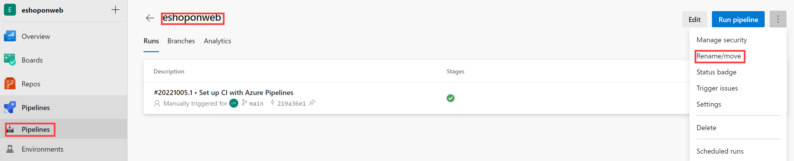

---
lab:
  title: Implementación de la seguridad y el cumplimiento en una canalización de Azure DevOps
  module: 'Module 07: Implement security and validate code bases for compliance'
---

# Implementación de la seguridad y el cumplimiento en una canalización de Azure DevOps

# Manual de laboratorio para alumnos

## Requisitos del laboratorio

- Este laboratorio requiere **Microsoft Edge** o un [explorador compatible con Azure DevOps](https://learn.microsoft.com/azure/devops/server/compatibility?view=azure-devops#web-portal-supported-browsers).

- **Configurar una organización de Azure DevOp:**: si aún no tiene una organización Azure DevOps que pueda usar para este laboratorio, cree una siguiendo las instrucciones disponibles en [Creación de una organización o colección de proyectos](https://learn.microsoft.com/azure/devops/organizations/accounts/create-organization?view=azure-devops).

## Introducción al laboratorio

En este laboratorio, usarás **Mend Bolt (anteriormente, WhiteSource)** para detectar automáticamente componentes de código abierto vulnerables, bibliotecas obsoletas y problemas de cumplimiento de licencias en tu código. Usarás WebGoat, una aplicación web intencionadamente insegura mantenida por OWASP y diseñada para ilustrar problemas comunes de seguridad de aplicaciones web.

[Mend](https://www.mend.io/) es líder en la administración continua de seguridad y cumplimiento de software código abierto. WhiteSource se integra en el proceso de compilación, independientemente de los lenguajes de programación, las herramientas de compilación o los entornos de desarrollo. Funciona de forma automática, continua y silenciosa en segundo plano, comprobando la seguridad, las licencias y la calidad de los componentes de código abierto con la base de datos definitiva de repositorios de código abierto que WhiteSource actualiza constantemente.

Mend ofrece Mend Bolt, una solución ligera de seguridad y administración de código abierto desarrollada específicamente para integrarse con Azure DevOps y Azure DevOps Server. Ten en cuenta que Mend Bolt funciona por proyecto y no ofrece capacidades de alerta en tiempo real, lo que requiere una **plataforma completa**, generalmente recomendada para equipos de desarrollo más grandes que quieren automatizar su administración de código abierto a lo largo de todo el ciclo de vida de desarrollo de software (desde los repositorios hasta las fases posteriores a la implementación) y en todos los proyectos y productos.

La integración de Azure DevOps con Mend Bolt le permitirá:

- Detectar y solucionar componentes de código abierto vulnerables.
- Generar informes completos de inventario de código abierto por proyecto o compilación.
- Aplicar código abierto cumplimiento de licencias, incluidas las licencias de las dependencias.
- Identificar las bibliotecas de código abierto obsoletas con recomendaciones que se van a actualizar.

## Objetivos

Después de completar este laboratorio, podrá:

- Activar Mend Bolt
- Ejecutar una canalización de compilación y revisar el informe de seguridad y cumplimiento de Mend

## Tiempo estimado: 45 minutos

## Instrucciones

### Ejercicio 0: configuración de los requisitos previos del laboratorio

En este ejercicio, configurarás los requisitos previos para el laboratorio, lo que supone crear un nuevo proyecto de Azure DevOps con un repositorio basado en [eShopOnWeb](https://github.com/MicrosoftLearning/eShopOnWeb).

#### Tarea 1: (omitir si ya la has completado) crear y configurar el proyecto del equipo

En esta tarea, crearás un proyecto de **eShopOnWeb** de Azure DevOps que se usará en varios laboratorios.

1.  En el equipo del laboratorio, en una ventana del explorador, abre la organización de Azure DevOps. Haz clic en **Nuevo proyecto**. Asígnale al proyecto el nombre **eShopOnWeb** y deja los demás campos con los valores predeterminados. Haga clic en **Crear**.

    

#### Tarea 2: (omitir si ha terminado) Importar repositorio de Git eShopOnWeb

En esta tarea, importarás el repositorio de Git eShopOnWeb que se usará en varios laboratorios.

1.  En el equipo del laboratorio, en una ventana del explorador, abre la organización de Azure DevOps y el proyecto **eShopOnWeb** creado anteriormente. Haz clic en **Repos>Archivos**, **Importar**. En la ventana **Importar un repositorio de Git**, pega la siguiente dirección URL https://github.com/MicrosoftLearning/eShopOnWeb.git y haz clic en **Importar**:

    

1.  El repositorio se organiza de la siguiente manera:
    - La carpeta **.ado** tiene canalizaciones de YAML de Azure DevOps.
    - El contenedor de carpetas **.devcontainer** está configurado para realizar el desarrollo con contenedores (ya sea localmente en VS Code o GitHub Codespaces).
    - La carpeta **.azure** contiene la infraestructura de Bicep&ARM como plantillas de código usadas en algunos escenarios de laboratorio.
    - Definiciones de flujo de trabajo de GitHub YAML del contenedor de carpetas **.github**.
    - La carpeta **src** contiene el sitio web de .NET 6 que se utiliza en los escenarios de laboratorio.

### Ejercicio 1: Implementación de seguridad y cumplimiento en una canalización de Azure DevOps mediante Mend Bolt

En este ejercicio, usa Mend Bolt para examinar el código del proyecto en busca de vulnerabilidades de seguridad y problemas de cumplimiento de licencias y ver el informe resultante.

#### Tarea 1: Activación de la extensión de Mend Bolt

En esta tarea, activarás WhiteSource Bolt en el proyecto de Azure Devops recién generado.

1.  En el equipo de laboratorio, en la ventana del explorador web que muestra el portal de Azure DevOps con el proyecto **eShopOnWeb** abierto, haz clic en el icono de Marketplace > **Examinar Marketplace**.

    

1.  En Marketplace, busca **Mend Bolt (anteriormente WhiteSource)** y ábrelo. Mend Bolt es la versión gratuita de la herramienta WhiteSource conocida anteriormente, que examina todos los proyectos y detecta componentes de código abierto, su licencia y vulnerabilidades conocidas.

    > Advertencia: asegúrate de seleccionar la opción Mend **Bolt** (la **gratuita**).

1.  En la página **Mend Bolt (anteriormente WhiteSource),** haz clic en **Obtenerlo de forma gratuita**.

    

1.  En la página siguiente, selecciona la organización de Azure DevOps correspondiente e **Instalar**. **Continúe con la organización** cuando haya finalizado la instalación.

1.  En Azure DevOps, ve a **Configuración de la organización** y selecciona **Mend** en **Extensiones**. Proporciona tu correo electrónico profesional (**tu cuenta personal del laboratorio**, por ejemplo, con AZ400learner@outlook.com en lugar de student@microsoft.com), el nombre de la empresa y otros detalles, y haz clic en el botón **Crear cuenta** para empezar a usar la versión gratuita.

    

#### Tarea 2: crear y desencadenar una compilación

En esta tarea, crearás y desencadenarás una canalización de compilación de CI en el proyecto de Azure DevOps. Usarás la extensión **Mend Bolt** para identificar los componentes vulnerables del sistema operativo presentes en este código.

1.  En el equipo de laboratorio, en el proyecto de Azure DevOps **eShopOnWeb**, en la barra de menús vertical a la izquierda, ve a la sección **Canalizaciones > Canalizaciones**, y haz clic en **Crear canalización** (o en **Nueva canalización**).

1.  En la ventana **¿Dónde está el código?**, selecciona **Azure Repos Git (YAML)** y selecciona el repositorio **eShopOnWeb**.

1.  En la sección **Configurar**, selecciona **Archivo YAML de Azure Pipelines existente**. Proporciona la siguiente ruta de acceso **/.ado/eshoponweb-ci-mend.yml** y haz clic en **Continuar**.

    

1.  Revisa la canalización y haz clic en **Ejecutar**. Tardará unos minutos en ejecutarse correctamente.
    > **Nota**: la compilación tardará algunos minutos en completarse. La canalización de compilación está formada por las siguientes tareas:
    - **DotnetCLI** es la tarea para restaurar, compilar, probar y publicar el proyecto dotnet.
    - **Whitesource** (mantiene el nombre antiguo) es la tarea para ejecutar el análisis de herramientas Mend de las bibliotecas del OSS.
    - **Publicar artefactos** es donde los agentes que ejecutan esta canalización cargarán el proyecto web publicado.

1.  Mientras se ejecuta la canalización, vamos a **cambiarle el nombre** para identificarlo más fácilmente (ya que el proyecto se puede usar para varios laboratorios). Ve a la sección **Canalizaciones/Canalizaciones** del proyecto de Azure DevOps, haz clic en el nombre de la canalización en ejecución (obtendrás un nombre predeterminado) y busca la opción **Cambiar nombre/mover** en el icono de puntos suspensivos. Cambia el nombre a **eshoponweb-ci-mend** y haz clic en **Guardar**.

    

1.  Una vez finalizada la ejecución de la canalización, puedes revisar los resultados. Abre la ejecución más reciente de la canalización **eshoponweb-ci-mend**. La pestaña de resumen mostrará los registros de la ejecución, junto con detalles relacionados, como la versión (confirmación) del repositorio usada, el tipo de desencadenador, los artefactos publicados, la cobertura de pruebas, etc.

1. En la pestaña **Mend Bolt**, puedes revisar el análisis de seguridad de OSS. Verás detalles sobre el inventario usado, las vulnerabilidades encontradas (y cómo resolverlas) y un informe interesante sobre las licencias relacionadas con la biblioteca. Tómate un tiempo para revisar el informe.

    

## Revisar

En este laboratorio, usarás **Mend Bolt con Azure DevOps** para detectar automáticamente componentes de código abierto vulnerables, bibliotecas obsoletas y problemas de cumplimiento de licencias en el código.
